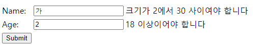
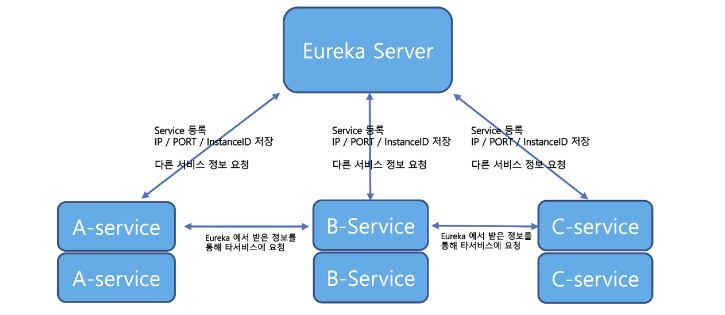
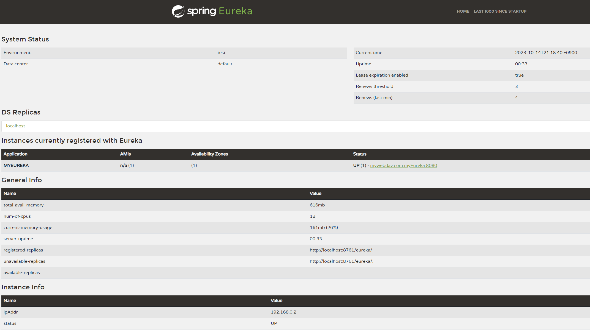

<details>
  <summary>프로젝트 생성</summary>

## 프로젝트 생성
https://start.spring.io/ 에서 원하는 의존성을 추가한후 아래의`Generate` 버튼으로 zip 파일 받습니다.

</details>

<details>
  <summary>기본형태</summary>

## 기본 형태
```java
	@GetMapping("/hello")
	public String hello(@RequestParam(value = "name", defaultValue = "World") String name) {
		return String.format("Hello %s!", name);
	}
```
`http://localhost:8080/hello?name=merci` 으로 요청하면
`Hello merci!` 로 응답

</details>

<details>
  <summary>@SpringBootApplication</summary>


## @SpringBootApplication

```java
@Target(ElementType.TYPE)
@Retention(RetentionPolicy.RUNTIME)
@Documented
@Inherited
@SpringBootConfiguration
@EnableAutoConfiguration
@ComponentScan(excludeFilters = { @Filter(type = FilterType.CUSTOM, classes = TypeExcludeFilter.class),
		@Filter(type = FilterType.CUSTOM, classes = AutoConfigurationExcludeFilter.class) })
public @interface SpringBootApplication { // ...
```
`@SpringBootConfiguration`, `@EnableAutoConfiguration`, `@ComponentScan` 로 구성되어 있습니다.

- `@SpringBootConfiguration`<br>
  스프링의 기본 설정 클래스를 구성하고 `@configuration`으로 설정된 `bean` 등록<br>
  -> 스프링 MVC 및 IoC 컨테이너 등록
  <br>


- `@EnableAutoConfiguration`<br>
  자동 구성을 활성화 -> 클래스 패스(+`build.gradle`)에 기반하여 `bean` 등록<br> `spring.factories` 파일을 기반으로 스프링부트의 자동 구성 `bean` 등록<br>

  (`spring-context.xml`의 역할)


- `@ComponentScan`은 현재 패키지 및 하위 패키지를 스캔하여 컴포넌트를 찾아서 `bean` 등록<br>
여기서 간과하지 말아야 할 부분은 절대적으로 `@SpringBootApplication`이 붙은 클래스가 지엽적은 디렉토리에 있다면 외부 빈들을 등록하지 못한다 !!!!!!<br>


- 따라서 실행 패키지 내부에 컨트롤러가 특별히 지정되어 있지 않다면 스프링은 기본적으로 `static/index.html`
을 기본적인 `localhost:8080/` 요청의 응답으로 반환합니다.<br>
이러한 설정은 다른 프레임워크에서도 동일한 기능입니다.( ex. express 등..)

이러한 자동구성에서 제외시키고 싶을때는 아래의 방법을 이용합니다.
```java
@SpringBootApplication(exclude = { DataSourceAutoConfiguration.class })
```

</details>

<details>
  <summary>CRUDRepository / JPARepository 차이</summary>

### CRUDRepository / JPARepository 차이

`CRUDRepository`는 Spring Data JPA 의 상위 인터페이스입니다.

`JPARepository`는 위 인터페이스에 추가로 JPA메소드를 가지고 있습니다.

`CrudRepository`가 기본 제공하는 메소드로는 다음과 같습니다.
```java
  save(S entity), saveAll(Iterable<S> entities)
  findById(ID id), existsById(ID id)
  findAll(), findAllById(Iterable<ID> ids)
  count(),
  deleteById(ID id), delete(S entity),
  deleteAll((Iterable<? extends T> entities)), deleteAll()
```

CrudRepository를 상속하면 다음처럼 만들 수 있스니다.
```java
public interface CustomerRepository extends CrudRepository<Customer, Long> {

  // 하나의 엔티티만 반환할 경우 Optional을 사용한다.
  List<Customer> findByLastName(String lastName);

//  Optional<Customer> findById(long id); CrudRepository는 이미 findById를 제공한다.
}
```

또한 JPA를 사용할때는 다음과 같은 엔티티를 생성합니다.<br>
여기서 `@Id`, `@Entity`는 `javax.persistence`패키지를 사용합니다.
```java
@Entity
@NoArgsConstructor
@Getter
public class Customer {

  /**
   * 자동 증가
   */
  @Id
  @GeneratedValue(strategy= GenerationType.AUTO)
  private Long id;
  private String firstName;
  private String lastName;

  public Customer(String firstName, String lastName) {
    this.firstName = firstName;
    this.lastName = lastName;
  }

  @Override
  public String toString() {
    return String.format(
        "Customer[id=%d, firstName='%s', lastName='%s']",
        id, firstName, lastName);
  }
}
```
</details>

<details>
  <summary>@JsonIgnoreProperties, @JsonProperty</summary>

## @JsonIgnoreProperties

- `@JsonIgnoreProperties` 는 Jackson 라이브러리에서 제공하는 어노테이션으로 json에 있지만 java오브젝트에 매칭되는 변수명이 없을때 발생하는 에러를 무시해줍니다.<br>
- json 직렬화, 역직렬화 과정에서 데이터를 주고 싶지 않거나 받고 싶지 않을때 사용할 수 있습니다.
```agsl
@JsonIgnoreProperties({"password", "secretKey"})
public class User {

    private String username;
    private String password;
    private String email;
    private String secretKey;

}
```
일반적으로 여러 프레임워크는 json 역직렬화에서 없는 필드를 받을 경우 에러를 발생시키지 않습니다. <br>
이러한 에러는 아래 설정을 통해서 발생시킬 수 있습니다. <br><br>
`false`를 `true`로 변경하면 역직렬화시 json속성에 매칭되는 java필드가 없다면 에러가 발생합니다.
```java
ObjectMapper mapper = new ObjectMapper();
mapper.configure(DeserializationFeature.FAIL_ON_UNKNOWN_PROPERTIES, false);
```
## @JsonProperty

`@JsonProperty`는 Jackson 라이브러리에서 제공하는 어노테이션으로 json과 자바오브젝트의 변수 이름이 매칭되지 않을때 매칭시켜 줍니다.
```java
@Getter
@Setter
public class Person {
    @JsonProperty("full_name")
    private String name;
    private int age;
}
```


</details>

<details>
  <summary>RestTemplate</summary>

## RestTemplate

Rest서버에 요청을 보내 Rest클라이언트의 기능을 만들어줍니다.<br>
GUI기반의 Rest클라이언트는 Postman, Insomnia 같은것들이 있습니다.

Http요청을 보내기 위해서 `RestTemplate`객체를 코드 블록에서 직접 생성하거나
```java
RestTemplate rt = new RestTemplate();
```
Bean에 등록해서 의존성을 주입받아 사용합니다.
```java
  @Bean
  public RestTemplate restTemplate(RestTemplateBuilder builder) {
        return builder.build();
  }
```

`RestTemplate`를 이용한 Http의 기본적인 요청 방법은 아래와 같습니다.
- Get
```java
String result = restTemplate.getForObject("https://api.example.com/data", String.class);
```
- Post<br>
기본적으로 `restTemplate`은 객체를 `Json`으로 변환합니다.
```java
MyRequestObject request = new MyRequestObject("data");
MyResponseObject response = restTemplate.postForObject("https://api.example.com/data", request, MyResponseObject.class);
```

Post요청으로 응답 받을때 `ResponseEntity`를 이용할 수 있습니다.<br>
`ResponseEntity`는 헤더와 바디데이터를 포함하므로 `getBody()`같은 메소드로 데이터를 꺼낼 수 있습니다.
```java
ResponseEntity<MyResponseClass> response = restTemplate.postForEntity(url, requestObject, MyResponseClass.class);
MyResponseClass responseBody = response.getBody();
```

- Put<br>
Put은 Get, Post와 다른 방법을 사용합니다.

```java
String url = "https://example.com/api/resource";
MyClass requestObject = new MyClass();

restTemplate.put(url, requestObject);
```
- 인증
```java
restTemplate.getInterceptors().add(new BasicAuthenticationInterceptor("username", "password"));
```
- 에러 처리
```java
restTemplate.setErrorHandler(new MyCustomErrorHandler());
```
- exchange
  - HTTP 메서드, 요청 엔터티, 응답 타입 등을 명시적으로 지정
  - 반환 타입은 `ResponseEntity<T>`

```java
HttpHeaders headers = new HttpHeaders();
headers.setContentType(MediaType.APPLICATION_JSON);
MyRequestObject request = new MyRequestObject("data");
HttpEntity<MyRequestObject> entity = new HttpEntity<>(request, headers);

ResponseEntity<MyResponseObject> response = restTemplate.exchange(
    "https://api.example.com/data",
    HttpMethod.POST,
    entity, // get 이라면 null
    MyResponseObject.class
);
MyResponseObject responseBody = response.getBody();

```
또는 카카오에 요청할때 사용한 방법으로 Map을 이용해서 요청합니다.
```java
  HttpHeaders headers = new HttpHeaders();
  headers.setContentType(MediaType.APPLICATION_FORM_URLENCODED);

  MultiValueMap<String, String> xForm = new LinkedMultiValueMap<>();
  xForm.add("grant_type", "authorization_code");
  xForm.add("client_id", "받은 키");
  xForm.add("redirect_uri", "http://localhost:8080/callback");
  xForm.add("code", code);

  HttpEntity<?> httpEntity = new HttpEntity<>(xForm,headers);
  ResponseEntity<String> responseEntity = rt.exchange(
        kakaoUrl,
        HttpMethod.POST,
        httpEntity,
        String.class);

  String responseBody = responseEntity.getBody();
```


</details>

<details>
  <summary>CommandLineRunner</summary>

## CommandLineRunner

애플리케이션 시작 시 실행되어야 하는 코드를 정의합니다.

`@SpringBootApplication` 클래스에 아래의 모양으로 만들게 되면 파라미터는 자동으로 주입됩니다. 
```java
	@Bean
	public CommandLineRunner run(RestTemplate restTemplate) throws Exception {
		return args -> { // 람다 표현식의 관용적인 형태
			Quote quote = restTemplate.getForObject(
					"http://localhost:8080/api/random", Quote.class);
			log.info(quote.toString());
		};
	}
```
8080포트로 열려있는 서버에 요청을 보내 받은 응답을 `Quote`로 받고 로그를 출력합니다.

또는 아래와 같은 모양으로 구현합니다.
```java
/**
 * CommandLineRunner를 구현하고 run 메소드를 재구성해서 원하는 기능을 구현한 형태
 */
@Component
public class Runner implements CommandLineRunner {

    private final RabbitTemplate rabbitTemplate;
    private final Receiver receiver;

    public Runner(Receiver receiver, RabbitTemplate rabbitTemplate) {
        this.receiver = receiver;
        this.rabbitTemplate = rabbitTemplate;
    }

    @Override
    public void run(String... args) throws Exception {
        System.out.println("Sending message...");
    }
}
```
</details>

<details>
  <summary>@EnableScheduling</summary>

## @EnableScheduling

`@EnableScheduling` 어노테이션을 Spring Configuration 클래스에 추가한다면
`@Scheduled` 어노테이션이 붙은 메서드를 자동으로 찾아 주기적으로 실행합니다.

```java
@SpringBootApplication
@EnableScheduling
public class SpringbreakingApplication {

  public static void main(String[] args) {
    SpringApplication.run(SpringbreakingApplication.class, args);
  }
}
```
아래 메소드는 `bean`으로 등록된 클래스 내부에 있어야 합니다.
```java
	@Scheduled(fixedRate = 5000)
	public void reportCurrentTime() {
		log.info("The time is now {}", dateFormat.format(new Date()));
	}
```

</details>

<details>
  <summary>Gradle 빌드</summary>

## Gradle 

java기반 프로젝트 관리 도구인 Maven의 장황한 설정을 보완하기 위해 나온 빌드 도구입니다.

아래 커맨드로 gradle로 실행 가능한 작업 목록을 볼 수 있습니다.
```java
$ gradle tasks
```

```java
Starting a Gradle Daemon (subsequent builds will be faster)

> Task :tasks

------------------------------------------------------------
Tasks runnable from root project 'springbreaking'
------------------------------------------------------------

Application tasks
-----------------
bootRun - Runs this project as a Spring Boot application.

Build tasks
-----------
assemble - Assembles the outputs of this project.
bootBuildImage - Builds an OCI image of the application using the output of the bootJar task
bootJar - Assembles an executable jar archive containing the main classes and their dependencies.
bootJarMainClassName - Resolves the name of the application's main class for the bootJar task.
bootRunMainClassName - Resolves the name of the application's main class for the bootRun task.
build - Assembles and tests this project.
buildDependents - Assembles and tests this project and all projects that depend on it.
buildNeeded - Assembles and tests this project and all projects it depends on.
classes - Assembles main classes.
clean - Deletes the build directory.
jar - Assembles a jar archive containing the main classes.
testClasses - Assembles test classes.

Build Setup tasks
-----------------
init - Initializes a new Gradle build.
wrapper - Generates Gradle wrapper files.

Documentation tasks
-------------------
javadoc - Generates Javadoc API documentation for the main source code.
Rules
-----
Pattern: clean<TaskName>: Cleans the output files of a task.
Pattern: build<ConfigurationName>: Assembles the artifacts of a configuration.

To see all tasks and more detail, run gradle tasks --all

To see more detail about a task, run gradle help --task <task>

BUILD SUCCESSFUL in 41s
1 actionable task: 1 executed

```

## Gradle Wrapper

gradle Wrapper 를 이용하면 gradle를 설치하지 않고 버전에 상관없이 일관된 빌드를 구성할 수 있습니다.

gradle 프로젝트를 생성할 때 소스를 확인하면 gradle wrapper가 포함된 gradle 디렉토리가 있습니다.

`gradle-wrapper.properties` 파일 내부
```java
distributionBase=GRADLE_USER_HOME
distributionPath=wrapper/dists
distributionUrl=https\://services.gradle.org/distributions/gradle-8.2.1-bin.zip
networkTimeout=10000
validateDistributionUrl=true
zipStoreBase=GRADLE_USER_HOME
zipStorePath=wrapper/dists
```
wrapper를 이용할 때는 주로 아래 커맨드들을 이용합니다.
```java
$ ./gradlew run // java 애플리케이션 실행
```
```java
$ ./gradlew bootRun // SpringBoot 애플리케이션 실행
```

```java
$ ./gradlew bootJar // 실행 가능한 boot 기반 jar파일 생성
```
```java
$ ./gradlew clean build // build 디렉토리를 삭제하고 빋르 ( 테스트 진행 )
```
</details>

<details>
  <summary>JDBCTemplate</summary>

## JDBCTemplate

- java의 JDBC 코드를 단순화하여 공통적인 문제를 처리하기 위해 사용합니다.<br>
- JDBC를 사용할때 반복적으로 사용되는 연결, `PreparedStatement`, `ResultSet`같은 코드를 생략합니다.<br>
- JDBC의 `SQLException`을 스프링의 `DataAccessException`로 변홥합니다.<br>
- 리소스의 메모리를 자동으로 관리해주며 Batch를 처리할 수 있습니다.<br>


`JDBCTemplate` 를 이용하기 위해서는 아래 의존성이 필요합니다.
```java
implementation 'org.springframework.boot:spring-boot-starter-data-jdbc'
```

JPA 의존성은 `spring-boot-starter-data-jdbc` 의존성을 포함합니다.
```java
implementation 'org.springframework.boot:spring-boot-starter-data-jpa'
```

JDBCTemplate를 사용하기 위해서는 먼저 DataSource를 등록해야 합니다.
```java
private final JdbcTemplate jdbcTemplate;

public JdbcTemplateItemRepository(DataSource dataSource) {
	this.jdbcTemplate = new JdbcTemplate(dataSource);
}
```

JPA의존성을 추가했다면 yml의 Datasource 설정을 바탕으로 자동 구성이 이루어집니다.
(해당 드라이버 필요)

JDBCTemplate의 메소드로는
  INSERT, UPDATE, DETELTE, queryForObject, queryForInt, RowMapper, QUERY, EXECUTE, BATCH 같은 방법들이 있습니다.
( 추후 자세히 알아보자 )

</details>

<details>
  <summary>파일 업로드</summary>

## 파일 업로드

파일을 업로드 하기 위해서 최대 업로드 크기를 설정합니다.
```yml
spring:
  servlet:
    multipart:
      max-file-size: 128KB # 최대 크기 제한
      max-request-size: 128KB # formData 요청 크기 제한
```

서비스를 정의 합니다.

```java
@Service
@RequiredArgsConstructor
public class FileSystemStorageServiceImpl implements StorageService {

	private final Path rootLocation;

	/**
	 * 디렉토리가 없다면 생성한다.
	 * 외부설정이 아래처럼 되어 있다면 'someDirectory'가 존재 하지 않을 경우 디렉토리를 생성
	 *
	 * storage:
	 *   location: D:\someDirectory
	 */
	@Override
	public void init() {
		try {
			Files.createDirectories(rootLocation);
		}
		catch (IOException e) {
			throw new StorageException("Could not initialize storage", e);
		}
	}


	/**
	 * 리소스를 받아서 저장
	 *
	 * destinationFile에는 파일을 저장할 절대 경로를 초기화
	 * getInputStream() 통해 입력 스트림을 얻은 뒤 저장할 경로에 저장
	 * StandardCopyOption.REPLACE_EXISTING : 덮어쓰기
	 * @param file
	 */
	@Override
	public void store(MultipartFile file) {
		try {
			// 리소스가 전달되지 않았으면 익셉션
			if (file.isEmpty()) {
				throw new StorageException("Failed to store empty file.");
			}

			// 리소스를 저장할 절대 경로를 설정
			Path destinationFile = this.rootLocation.resolve(
							Paths.get(file.getOriginalFilename()))
					.normalize().toAbsolutePath();

			// 외부에 저장될 때 익셉션
			if (!destinationFile.getParent().equals(this.rootLocation.toAbsolutePath())) {
				// This is a security check
				throw new StorageException(
						"Cannot store file outside current directory.");
			}

			// 스트림을 통해 리소스를 저장
			try (InputStream inputStream = file.getInputStream()) {
				Files.copy(inputStream, destinationFile,
						StandardCopyOption.REPLACE_EXISTING);
			}
		}
		catch (IOException e) {
			throw new StorageException("Failed to store file.", e);
		}
	}


	/**
	 * 디렉토리 내부의 파일과 디렉토리의 정보를 가져오기 위한 메소드
	 * 지정 혹은 생성된 디렉토리의 모든 리소스의 Path를 스트림으로 반환
	 *
	 * Files.walk() : 재귀적 탐색, 두번째 인자는 탐색할 뎁스 지정
	 * filter : 부모 디렉토리 경로를 제외
	 * map : relativize 메소드로 상대경로를 반환
	 * @return
	 */
	@Override
	public Stream<Path> loadAll() {
		try {
			// 직계 자식만 탐색
			return Files.walk(this.rootLocation, 1)
					.filter(path -> !path.equals(this.rootLocation))
					.map(this.rootLocation::relativize);
		}
		catch (IOException e) {
			throw new StorageException("Failed to read stored files", e);
		}

	}

	// 루트 디렉토리 + 파일 이름 -> Path 반환
	@Override
	public Path load(String filename) {
		return rootLocation.resolve(filename);
	}


	/**
	 * 리소스 가져오기
	 * @param filename
	 * @return
	 */
	@Override
	public Resource loadAsResource(String filename) {
		try {
			// 가져온 Path를 통해 리소스를 반환 (다운로드)
			Path file = load(filename);
			Resource resource = new UrlResource(file.toUri());
			if (resource.exists() || resource.isReadable()) {
				return resource;
			}
			// 리소스를 찾지 못했을 때
			else {
				throw new StorageFileNotFoundException(
						"Could not read file: " + filename);
			}
		}
		// 경로가 잘못되었을 때
		catch (MalformedURLException e) {
			throw new StorageFileNotFoundException("Could not read file: " + filename, e);
		}
	}

	/**
	 * 생성한 디렉토리를 삭제 - CommandLineRunner에 의해 서버 실행 시 디레토리 리셋
	 */
	@Override
	public void deleteAll() {
		FileSystemUtils.deleteRecursively(rootLocation.toFile());
	}

}
```

컨트롤러를 정의합니다.
```java
@Controller
@RequiredArgsConstructor
public class FileUploadController {

    // 추상화된 인터페이스를 의존 - 유연성
    private final StorageService storageService;

    /**
     * Thymeleaf를 사용하면 String 반환을 src/main/resources/templates/ 내부의 html로 매핑
     * 
     * 디렉토리의 모든 파일을 가져와 모델에 전달
     * MvcUriComponentsBuilder.fromMethodName()를 통해서 리소스를 다운받을 URL을 제공
     *
     * @param model
     * @return
     * @throws IOException
     */
    @GetMapping("/")
    public String listUploadedFiles(Model model) throws IOException {
        model.addAttribute("files", storageService.loadAll().map(
                        path -> MvcUriComponentsBuilder.fromMethodName(FileUploadController.class,
                                "serveFile", path.getFileName().toString()).build().toUri().toString())
                .collect(Collectors.toList()));
        
        return "uploadForm";
    }


    /**
     * 뷰에서 제공받은 url을 받아서 리소스를 반환 (다운로드)
     * 
     * `.+` : 정규표현식으로 파일명에 `.`이 포함될 수 있음 -> ex) image.jpg     *
     * Content-Disposition : 헤더를 통해 다운로드 가능하도록 함
     * .body(file) : 리소스를 반환
     *
     * @param filename
     * @return
     */
    @GetMapping("/files/{filename:.+}")
    @ResponseBody
    public ResponseEntity<Resource> serveFile(@PathVariable String filename) {

        // 리소스 가져오기
        Resource file = storageService.loadAsResource(filename);
        return ResponseEntity.ok().header(HttpHeaders.CONTENT_DISPOSITION,
                "attachment; filename=\"" + file.getFilename() + "\"").body(file);
    }

    /**
     * submit -> 파일을 저장
     * addFlashAttribute : 리다이렉션 후 한번만 표시 - 새로고침하면 메세지는 사라짐 + listUploadedFiles에 의해서 파일 다운로드 URL 뷰에 생성
     *
     * @param file
     * @param redirectAttributes
     * @return
     */
    @PostMapping("/")
    public String handleFileUpload(@RequestParam("file") MultipartFile file,
                                   RedirectAttributes redirectAttributes) {

        storageService.store(file);
        redirectAttributes.addFlashAttribute("message",
                "You successfully uploaded " + file.getOriginalFilename() + "!");

        return "redirect:/";
    }


    /**
     * ResponseEntity는 HttpEntity를 구현한 클래스로써 상태코드와 응답데이터를 반환한다.
     * HttpEntity는 다양한 상태코드를 응답하지 못한다. ( 기본 200 )
     * 응답에 따른 다양한 상태코드를 응답하기 위해서는 ResonseEntity를 사용해야 한다.
     *
     * @param exc
     * @return
     */
    @ExceptionHandler(StorageFileNotFoundException.class)
    public ResponseEntity<?> handleStorageFileNotFound(StorageFileNotFoundException exc) {
        return ResponseEntity.notFound().build();
    }

}
```

</details>

<details>
  <summary>@ConfigurationProperties</summary>

## @ConfigurationProperties

스프링 부트에서 제공하는 어노테이션으로 외부 설정 파일의 ( `properties` or `yml` ) 속성을 java객체에 바인딩할 때 사용됩니다.

`(prefix = "app")`를 붙여서 특정 키워드로 시작하는 속성을 가져올 수도 있습니다.
```java
@ConfigurationProperties("storage") // (prefix = "storage")
@Getter
@Setter
public class StorageProperties {

	// 디폴트 값
	private String location = "upload-dir";
}
```
`properties` or `yml` 설정


```yml
storage:
  location: D:\ // path
```
위 접두사 설정에 따라 연결됩니다.

`@ConfigurationProperties`을 설정한 클래스의 필드를 가져오면 외부에서 설정한 속성을 java객체 내부로 가져올 수 있습니다.


</details>

<details>
  <summary>@Value 차이 (Lombok / org.springframework.beans.factory.annotation.Value)</summary>

## Lombok

롬복에서 사용하는 `@value`어노테이션은 필드를 불변하게 만들때 사용합니다.<br>
`private`, `final` 속성과 `Getter`, `equals()`, `hashCode()`, `toString()` 를 생성합니다.

## org.springframework.beans.factory.annotation.Value
스프링에서 제공하는 `@Value` 어노테이션은 외부 설정값을 가져올 때 사용합니다.
예를들어 위에서 외부설정 값을
```agsl
@Target({ElementType.FIELD, ElementType.METHOD, ElementType.PARAMETER, ElementType.ANNOTATION_TYPE})
@Retention(RetentionPolicy.RUNTIME)
@Documented
public @interface Value {

	/**
	 * The actual value expression such as <code>#{systemProperties.myProp}</code>
	 * or property placeholder such as <code>${my.app.myProp}</code>.
	 */
	String value();

}
```
```agsl
@Configuration
public class StorageConfig {

    @Value("${storage.location}")
    private String storageLocation;
    
    @Bean
    public Path storagePath() {
        return Paths.get(storageLocation);
    }
}
```
</details>

<details>
  <summary>서비스 인터페이스와 구현클래스 분리</summary>

## 서비스 인터페이스와 구현클래스 분리

개발을 하다보면 참고할 예제나 공식문서 그리고 설계된 프로젝트를 보면 `bean`으로 등록될 서비스는 추상화된 서비스 인터페이스를 구현하고 있는 경우가 많습니다. <br>
추상화된 서비스 인터페이스와 구현 클래스를 분리하는 이유는
 - 가독성, 서비스에 어떤 메소드가 구현되어야 하는데 한눈에 보기 좋습니다.
 - 추상화, 메소드를 추상화시켜 다양한 구현으로 필요에 따라 코드를 교체할 수 있습니다.
 - 확장성, 마찬가지로 설계 방향에 따라 다른 구현 클래스를 만들어 적용시킬 수 있습니다.
 - 협업성, 구현해야할 메소드를 정해두면 구현 클래스는 모든 메소드를 구현해야 합니다.
```agsl
public interface StorageService {

	void init(); // 인터페이스의 모든 메소드는 public 속성을 가짐
	// ... 다른 메소드들
}
```
```agsl
@Service
@RequiredArgsConstructor
public class FileSystemStorageServiceImpl implements StorageService {

	private final Path rootLocation;

	@Override
	public void init() {
		try {
			Files.createDirectories(rootLocation);
		}
		catch (IOException e) {
			throw new StorageException("Could not initialize storage", e);
		}
	}
	// ... 구현된 메소드들
}
```
</details>

<details>
  <summary> Redis Messaging </summary>

## Redis Messaging

Redis는 인메모리 데이터 구조 저장소로 키-값 형태로 데이터를 저장합니다.<br>
주로 여러 인스턴스 서버들의 앞단에서 세션이나 캐시 메모리의 형태로 활용되는 편입니다.<br>
Redis의 Pub/Sub 모델을 통해서 메시지 기능을 구현할 수 있습니다.<br>
하지만 Redis는 인메모리의 특성으로 보낸 메세지를 저장하지 않습니다.

### 메세지 보내기
먼저 Redis를 설치합니다.<br>
Mac
```
$ brew install redis
```
Windows
```
$ choco install redis-64
```
하지만 내 경우 chocolatey로 제대로 설치가 되지 않음 그래서 공홈에서 다운받음<br>
https://redis.io/docs/getting-started/

설명을 보니까 `Redis는 Windows에서 공식적으로 지원되지 않습니다.`<br>
우분투에 설치를 하라고 합니다.

차례대로 입력합니다.
```agsl
$ sudo apt install lsb-release curl gpg
```
```agsl
$ curl -fsSL https://packages.redis.io/gpg | sudo gpg --dearmor -o /usr/share/keyrings/redis-archive-keyring.gpg

$ echo "deb [signed-by=/usr/share/keyrings/redis-archive-keyring.gpg] https://packages.redis.io/deb $(lsb_release -cs) main" | sudo tee /etc/apt/sources.list.d/redis.list

$ sudo apt-get update
$ sudo apt-get install redis
```
설치가 완료되면 아래 커맨드로 Redis 서버를 실행합니다.
```agsl
$ sudo service redis-server start
Starting redis-server: redis-server.
```
Redis CLI를 통해서 Redis가 실행중인지 확인할 수 있습니다.
```agsl
$ redis-cli 
127.0.0.1:6379> ping
PONG
```
스프링부트에서 Redis를 사용하기 위해서 의존성과 포트설정이 필요합니다.
```agsl
implementation 'org.springframework.boot:spring-boot-starter-data-redis'
```
```
spring:
  redis:
    host: localhost
    port: 6379
```
 <br> <br> <br>
이제 Redis를 통해 메세지를 송수신해보겠습니다. <br>
모든 메세징 기반 서비스는 전송자와 수신자가 있습니다.

- 메세지 수신기 설정
```agsl
@Slf4j
public class Receiver {

    /**
     * Atomic - 원자적 - 스레드 안전, 동시 접근 불가
     * 여러 스레드가 동시에 카운터 값을 증가 시킬 경우에 사용
     */
    private AtomicInteger counter = new AtomicInteger();

    public void receiveMessage(String message) {
        log.info("Received <" + message + ">");
        counter.incrementAndGet();
    }

    public int getCount() {
        return counter.get();
    }
}
```

- 메세지 리스너 등록
```agsl
@Configuration
public class MessagingRedisApplication {

	/**
	 * Redis 메세지 리스너 컨테이너
	 * 'chat' 토픽의 메세지를 수신한다.
	 * @param connectionFactory
	 * @param listenerAdapter
	 * @return
	 */
	@Bean
	RedisMessageListenerContainer container(RedisConnectionFactory connectionFactory,
			MessageListenerAdapter listenerAdapter) {

		RedisMessageListenerContainer container = new RedisMessageListenerContainer();
		container.setConnectionFactory(connectionFactory);
		container.addMessageListener(listenerAdapter, new PatternTopic("chat"));

		return container;
	}

	/**
	 * 메세지 리스너 어뎁터
	 * Reciver객체의 'receiveMessage'메소드를 사용한다.
	 * @param receiver
	 * @return
	 */
	@Bean
	MessageListenerAdapter listenerAdapter(Receiver receiver) {
		return new MessageListenerAdapter(receiver, "receiveMessage");
	}

	/**
	 * Redis 메시지 수신기
	 * 메세지를 수신하고 카운트 증가 메소드가 있다.
	 * @return 
	 */
	@Bean
	Receiver receiver() {
		return new Receiver();
	}

	/**
	 * RedisConnectionFactory -> StringRedisTemplate 생성 및 반환
	 * StringRedisTemplate : Redis와의 문자열 통신을 담당
	 * @param connectionFactory
	 * @return
	 */
	@Bean
	StringRedisTemplate template(RedisConnectionFactory connectionFactory) {
		return new StringRedisTemplate(connectionFactory);
	}

}
```
- 메세지 전송 테스트 ( 폴링 방식 )
```agsl
	public static void main(String[] args) throws InterruptedException {

		// Redis 메세징, 진입점 클래스를 명시
		ApplicationContext ctx = SpringApplication.run(SpringbreakingApplication.class, args);

		StringRedisTemplate template = ctx.getBean(StringRedisTemplate.class);
		Receiver receiver = ctx.getBean(Receiver.class);

		/**
		 * Poling 메세지 리시버 활성화
		 * 'chat' 토픽으로 전송된 메시지일 경우에만 카운트 증가
		 */
		while (receiver.getCount() == 0) {

			log.info("Sending message...");
			template.convertAndSend("chat", "Hello from Redis!");
			Thread.sleep(500L);
		}

		// 애플리케이션 강제 종료
//		System.exit(0);
	}
```
끝으로 레디스 서버를 종료하는 방법
```agsl
$ redis-cli shutdown
```
</details>

<details>
  <summary>RabbitMQ Messaging</summary>

## RabbitMQ Messaging

RabbitMQ는 주로 메세지 브로커의 용도로 개발되었으며 안전하게 소비자에게 전달하는것을 목적으로 합니다.<br>
Redis는 단일 스레드 모델을 사용하지만 RabbitMQ는 다중 스레드 및 다중 노드 구성을 지원하여 확장성이 좋습니다.<br>
큐를 이용해 메세지를 전송합니다.

### 설치

RabbitMQ를 설치하는 다양한 가이드는 공홈을 참고하면 됩니다. https://www.rabbitmq.com/download.html

우분투일 경우 공홈에서는 Cloudsmith미러 저장소를 이용한 스크립트 설치를 권장하고 있습니다.
```agsl
#!/bin/sh

sudo apt-get install curl gnupg apt-transport-https -y

## Team RabbitMQ's main signing key
curl -1sLf "https://keys.openpgp.org/vks/v1/by-fingerprint/0A9AF2115F4687BD29803A206B73A36E6026DFCA" | sudo gpg --dearmor | sudo tee /usr/share/keyrings/com.rabbitmq.team.gpg > /dev/null
## Community mirror of Cloudsmith: modern Erlang repository
curl -1sLf https://ppa.novemberain.com/gpg.E495BB49CC4BBE5B.key | sudo gpg --dearmor | sudo tee /usr/share/keyrings/rabbitmq.E495BB49CC4BBE5B.gpg > /dev/null
## Community mirror of Cloudsmith: RabbitMQ repository
curl -1sLf https://ppa.novemberain.com/gpg.9F4587F226208342.key | sudo gpg --dearmor | sudo tee /usr/share/keyrings/rabbitmq.9F4587F226208342.gpg > /dev/null

## Add apt repositories maintained by Team RabbitMQ
sudo tee /etc/apt/sources.list.d/rabbitmq.list <<EOF
## Provides modern Erlang/OTP releases
##
deb [signed-by=/usr/share/keyrings/rabbitmq.E495BB49CC4BBE5B.gpg] https://ppa1.novemberain.com/rabbitmq/rabbitmq-erlang/deb/ubuntu jammy main
deb-src [signed-by=/usr/share/keyrings/rabbitmq.E495BB49CC4BBE5B.gpg] https://ppa1.novemberain.com/rabbitmq/rabbitmq-erlang/deb/ubuntu jammy main

# another mirror for redundancy
deb [signed-by=/usr/share/keyrings/rabbitmq.E495BB49CC4BBE5B.gpg] https://ppa2.novemberain.com/rabbitmq/rabbitmq-erlang/deb/ubuntu jammy main
deb-src [signed-by=/usr/share/keyrings/rabbitmq.E495BB49CC4BBE5B.gpg] https://ppa2.novemberain.com/rabbitmq/rabbitmq-erlang/deb/ubuntu jammy main

## Provides RabbitMQ
##
deb [signed-by=/usr/share/keyrings/rabbitmq.9F4587F226208342.gpg] https://ppa1.novemberain.com/rabbitmq/rabbitmq-server/deb/ubuntu jammy main
deb-src [signed-by=/usr/share/keyrings/rabbitmq.9F4587F226208342.gpg] https://ppa1.novemberain.com/rabbitmq/rabbitmq-server/deb/ubuntu jammy main

# another mirror for redundancy
deb [signed-by=/usr/share/keyrings/rabbitmq.9F4587F226208342.gpg] https://ppa2.novemberain.com/rabbitmq/rabbitmq-server/deb/ubuntu jammy main
deb-src [signed-by=/usr/share/keyrings/rabbitmq.9F4587F226208342.gpg] https://ppa2.novemberain.com/rabbitmq/rabbitmq-server/deb/ubuntu jammy main
EOF

## Update package indices
sudo apt-get update -y

## Install Erlang packages
sudo apt-get install -y erlang-base \
                        erlang-asn1 erlang-crypto erlang-eldap erlang-ftp erlang-inets \
                        erlang-mnesia erlang-os-mon erlang-parsetools erlang-public-key \
                        erlang-runtime-tools erlang-snmp erlang-ssl \
                        erlang-syntax-tools erlang-tftp erlang-tools erlang-xmerl

## Install rabbitmq-server and its dependencies
sudo apt-get install rabbitmq-server -y --fix-missing
```

해당 스크립트를 간단하게 만들고 나서 권한을 부여 후 실행합니다.
```agsl
$ touch RabbitMQ_install_by_Cloudsmith.sh

$ chmod +x RabbitMQ_install_by_Cloudsmith.sh

$ sh RabbitMQ_install_by_Cloudsmith.sh
```
그런 다음 RabbitMQ를 실행합니다.
```agsl
$ sudo rabbitmq-server start

  ##  ##      RabbitMQ 3.12.4
  ##  ##
  ##########  Copyright (c) 2007-2023 VMware, Inc. or its affiliates.
  ######  ##
  ##########  Licensed under the MPL 2.0. Website: https://rabbitmq.com

  Erlang:      26.0.2 [jit]
  TLS Library: OpenSSL - OpenSSL 3.0.2 15 Mar 2022
  Release series support status: supported

  Doc guides:  https://rabbitmq.com/documentation.html
  Support:     https://rabbitmq.com/contact.html
  Tutorials:   https://rabbitmq.com/getstarted.html
  Monitoring:  https://rabbitmq.com/monitoring.html

  Logs: /var/log/rabbitmq/rabbit@DESKTOP-PJ1Q12M.log
        <stdout>

  Config file(s): (none)

  Starting broker... completed with 0 plugins.
```
또한 중지하거나 상태를 확인할 수 있습니다.
```agsl
$ sudo rabbitmqctl stop

$ sudo rabbitmqctl status

OS PID: 3115
OS: Linux
Uptime (seconds): 78
Is under maintenance?: false
RabbitMQ version: 3.12.4
RabbitMQ release series support status: supported
Node name: rabbit@DESKTOP-PJ1Q12M
Erlang configuration: Erlang/OTP 26 [erts-14.0.2] [source] [64-bit] [smp:12:12] [ds:12:12:10] [async-threads:1] [jit:ns]
Crypto library: OpenSSL 3.0.2 15 Mar 2022
Erlang processes: 297 used, 1048576 limit
Scheduler run queue: 1
Cluster heartbeat timeout (net_ticktime): 60

Plugins

Enabled plugin file: /etc/rabbitmq/enabled_plugins
Enabled plugins:


Data directory

Node data directory: /var/lib/rabbitmq/mnesia/rabbit@DESKTOP-PJ1Q12M
Raft data directory: /var/lib/rabbitmq/mnesia/rabbit@DESKTOP-PJ1Q12M/quorum/rabbit@DESKTOP-PJ1Q12M

Config files


Log file(s)

 * /var/log/rabbitmq/rabbit@DESKTOP-PJ1Q12M.log
 * <stdout>
 
 (.... 생략) 
 
Listeners

Interface: [::], port: 25672, protocol: clustering, purpose: inter-node and CLI tool communication
Interface: [::], port: 5672, protocol: amqp, purpose: AMQP 0-9-1 and AMQP 1.0
```

이렇게 실행시키긴 했는데 이 방법은 서버를 임의로 시작하거나 디버깅을 위한 용도입니다.

공홈에서는 아래의 방법으로 서버를 실행시킵니다.
```agsl
$ systemctl start rabbitmq-server
```
하지만 `System has not been booted with systemd as init system (PID 1). Can't operate.` 에러가 나오는 경우가 발생합니다.

이는 도커 또는 WSL환경에서 실행했을때 발생하는 에러로 `systemd`를 활성화 해야 합니다.

먼저 powershell 에서 아래 커맨드를 입력합니다.
```agsl
$ wsl --update
```
그리고 아래 커맨드로 `systemd=true`를 확인합니다.
```agsl
$ cat /etc/wsl.conf

[boot]
systemd=true
```
추가로 부팅시 자동으로 실행하도록 하는 커맨드
```agsl
$ systemctl enable rabbitmq-server
```

### 메세지 보내기

리시버 설정
```java
/**
 * Receiver의 메세지 수신 방법을 정의하는 POJO
 */
@Component
public class Receiver {

  /**
   * 동시성 유틸리티 클래스 - 다른 스레드의 작업 완료를 기다림
   * 카운트가 0 이되면 await중인 스레드가 실행된다.
   * 일회성으로 사용되며 재사용될 수 없다.
   * 이러한 방법을 이용해 여러 스레드가 동시에 진행되도록 의도할 수 있다.
   * 프로덕션에서는 사실상 쓰이지 않는다.
   */
  private CountDownLatch latch = new CountDownLatch(1);

  public void receiveMessage(String message) {
    System.out.println("Received <" + message + ">");
    latch.countDown(); // 0 -> 실행
  }

  public CountDownLatch getLatch() {
    return latch;
  }

}
```

수신기 설정

```java
@SpringBootApplication
public class MessagingRabbitmqApplication {

  static final String topicExchangeName = "spring-boot-exchange";

  static final String queueName = "spring-boot";

  /**
   * 대기열 큐 생성
   * durable: false -> 지속되지 않음
   * @return
   */
  @Bean
  Queue queue() {
    return new Queue(queueName, false);
  }

  /**
   * 토픽 체인지 생성 반환, 교환기의 이름은 spring-boot-exchange
   * @return
   */
  @Bean
  TopicExchange exchange() {
    return new TopicExchange(topicExchangeName);
  }

  /**
   * 큐와 교환기를 바인딩 -> foo.bar.# 로 시작하는 라우팅 키로 전송된 메세지를 큐에 라우팅
   * @param queue
   * @param exchange
   * @return
   */
  @Bean
  Binding binding(Queue queue, TopicExchange exchange) {
    return BindingBuilder.bind(queue).to(exchange).with("foo.bar.#");
  }

  /**
   * 메세지 리스너 컨테이너 생성 - 큐에서 메세지를 수신하고 처리
   * @param connectionFactory
   * @param listenerAdapter
   * @return
   */
  @Bean
  SimpleMessageListenerContainer container(ConnectionFactory connectionFactory,
      MessageListenerAdapter listenerAdapter) {
    SimpleMessageListenerContainer container = new SimpleMessageListenerContainer();
    container.setConnectionFactory(connectionFactory);
    container.setQueueNames(queueName);
    container.setMessageListener(listenerAdapter);
    return container;
  }

  /**
   * 메세지 어댑터 - Receiver 객체를 사용하여 리스너 어댑터 생성
   * Receiver가 실제 메세지 처리 로직을 포함
   * @param receiver
   * @return
   */
  @Bean
  MessageListenerAdapter listenerAdapter(Receiver receiver) {
    return new MessageListenerAdapter(receiver, "receiveMessage");
  }

  public static void main(String[] args) throws InterruptedException {
    SpringApplication.run(MessagingRabbitmqApplication.class, args).close(); // close : RabbitMQ와 연결 종료
  }

}
```

동작 테스트
```java
/**
 * CommandLineRunner를 구현하고 run 메소드를 재구성해서 원하는 기능을 구현한 형태
 */
@Component
public class Runner implements CommandLineRunner {

  private final RabbitTemplate rabbitTemplate;
  private final Receiver receiver;

  public Runner(Receiver receiver, RabbitTemplate rabbitTemplate) {
    this.receiver = receiver;
    this.rabbitTemplate = rabbitTemplate;
  }

  @Override
  public void run(String... args) throws Exception {
    System.out.println("Sending message...");

    // 토픽 - 라우팅키를 지정
    // foo.bar.baz 탬플릿을 사용하여 바인딩과 일치하는 라우팅키로 교환기로 메세지를 라우팅
    rabbitTemplate.convertAndSend(MessagingRabbitmqApplication.topicExchangeName, "foo.bar.baz", "Hello from RabbitMQ!");
    // 수신될 때까지 최대 10초 대기
    receiver.getLatch().await(10000, TimeUnit.MILLISECONDS);
  }

}
```

실행 결과는
```java
Sending message...
Received <Hello from RabbitMQ!>
```

</details>

<details>
  <summary> Validation </summary>

## Validation

의존성을 먼저 추가합니다.
```java
implementation 'org.springframework.boot:spring-boot-starter-validation'
```

일반적으로 Java17 이상이라면 `jakarta.validation.constraints`<br>
그 아래라면 `javax.validation.constraints` 를 import 해야합니다.

`Valid`와  `Validated`의 차이는 Validated는 그룹 기능을 이용해서 validation 체크를 할 수 있습니다.

일반적으로 validation 어노테이션을 필드에 붙이고 http요청의 메소드에 `@Valid` 어노테이션을 붙여서 검사합니다.

간단한 구조는 아래와 같습니다.
```java
	/**
	 * Valid 체크의 간단한 방법으로 BindingResult에 에러를 담는다.
	 * 주로 AOP를 통해서 발생한 에러를 Advice로 처리할 수 있다.
	 * @param personForm
	 * @param bindingResult
	 * @return
	 */
	@PostMapping("/")
	public String checkPersonInfo(@Valid PersonForm personForm, BindingResult bindingResult) {

		// 직접 메소드에서 에러를 처리할 경우
		if (bindingResult.hasErrors()) {
			return "form";
		}

		return "redirect:/results";
	}
```
</details>

<details>
  <summary> WebMvcConfigurer </summary>

## WebMvcConfigurer

Spring MVC의 구성을 사용자 정의하기 위한 주요 방법 중 하나입니다.

```java
/**
 * WebMvcConfigurer - SpringMVC 구성 설정
 *
 * addResourceHandlers - 정적 리소스 처리
 * addViewControllers - url을 뷰에 매핑
 * configurePathMatch  - 경로 매칭
 * addCorsMappings - CORS 설정
 * addInterceptors - 인터셉터 설정
 * configureMessageConverters - 메세지 컨버터 설정
 * configureViewResolvers - 뷰 리졸버 설정
 * configureDefaultServletHandling - 기본 서블릿 설정
 * getValidator - validator 설정
 * addFormatters - 사용자 정의 fommatter 설정
 *
 */
```

보통 필수적으로 CORS 설정과 인터셉터 처리를 주로하는 편인것 같습니다.

</details>

<details>
  <summary> Thymeleaf </summary>

## 에러처리

`<td th:if="${#fields.hasErrors('name')}" >Name Error</td>` 이렇게 작성하면<br>
유효성 검사를 통과하지 못하면 `Name Error`가 화면에 표시된다.<br>
`<td th:if="${#fields.hasErrors('name')}" th:errors="*{name}">Name Error</td>`<br>
위처럼 한다면 `validation` 에서 설정된 조건으로 통과하지 못한 유효성을 화면에 표시해준다.

```html
<form action="#" th:action="@{/}" th:object="${personForm}" method="post">
    <table>
        <tr>
            <td>Name:</td>
            <td><input type="text" th:field="*{name}" /></td>
            <td th:if="${#fields.hasErrors('name')}" th:errors="*{name}">Name Error</td>
        </tr>
        <tr>
            <td>Age:</td>
            <td><input type="text" th:field="*{age}" /></td>
            <td th:if="${#fields.hasErrors('age')}" th:errors="*{age}">Age Error</td>
        </tr>
        <tr>
            <td><button type="submit">Submit</button></td>
        </tr>
    </table>
</form>
```


## Form 전송

> <Thymeleaf th 접두어><br>
th:text: HTML 태그의 텍스트 내용을 동적으로 설정합니다.<br>
th:value: input 필드의 값을 동적으로 설정합니다.<br>
th:each: 반복문을 사용하여 리스트나 배열의 항목을 순회합니다.<br>
th:if, th:unless: 조건문을 사용하여 특정 조건에 따라 태그를 렌더링하거나 숨깁니다.<br>
th:attr: 태그의 속성 값을 동적으로 설정합니다.<br>
th:action: 양식(form)의 action 속성 값을 동적으로 설정합니다.<br>

```html
<!DOCTYPE HTML>
<html xmlns:th="https://www.thymeleaf.org">
<head>
    <title>Getting Started: Handling Form Submission</title>
    <meta http-equiv="Content-Type" content="text/html; charset=UTF-8" />
</head>
<body>
<h1>Form</h1>
<form action="#" th:action="@{/greeting}" th:object="${greeting}" method="post">
    <p>Id: <input type="text" th:field="*{id}" /></p>
    <p>Message: <input type="text" th:field="*{content}" /></p>
    <p><input type="submit" value="Submit" /> <input type="reset" value="Reset" /></p>
</form>
</body>
</html>
```

</details>

<details>
  <summary> Spring Boot Actuator </summary>

## Spring Boot Actuator

Spring Boot Actuator는 애플리케이션의 운영 상태를 모니터링하고 관리하는데 도움을 주는 도구입니다.<br>

터미널에서 아래와 같은 요처을 했을때 json을 응답하는 서버를 만들어 봅시다.
```
$ curl http://localhost:9000/hello-world
```
```
{"id":1,"content":"Hello, World!"}
```

<br>

먼저 actuator 의존성을 추가합니다.
```java
implementation 'org.springframework.boot:spring-boot-starter-actuator'
```

<br>

이제 터미널에서 아래 커맨드를 요청하게 되면 actuator가 json을 응답합니다.
```java
$ curl localhost:9000
```
```java
{"timestamp":"2023-08-30T13:48:05.432+00:00","status":404,"error":"Not Found","message":"No message available","path":"/"}
```

컨트롤러를 다음과 같이 구성하고 엔드포인트로 요청을 보내면
```java
@Controller
public class HelloWorldController {

	private static final String template = "Hello, %s!";
	private final AtomicLong counter = new AtomicLong();

	@GetMapping("/hello-world")
	@ResponseBody
	public Greeting sayHello(@RequestParam(name="name", required=false, defaultValue="Stranger") String name) {
		return new Greeting(counter.incrementAndGet(), String.format(template, name));
	}

}
```
```java
@Getter
@AllArgsConstructor
public class Greeting {

	private final long id;
	private final String content;
}
```
RestController가 json을 응답하게 됩니다. <br>

```java
$ curl localhost:8080/hello-world

        {"id":1,"content":"Hello, Stranger!"}
```
이때  `MappingJackson2HttpMessageConverter`가 자바 오브젝트를 json으로 변환시켜 줍니다. <br>
그리고 http 요청 헤더가 `application/json` 일 경우에도 발동합니다. <br>
이러한 컨버터는 `spring-boot-starter-web` 의존성에 포함되어 있습니다.

actuator는 모니터링 기능을 제공할 뿐 사용하지 않더라도 애플리케이션의 응답은 달라지지 않습니다.<br>
`/actuator` 와 관련된 엔드포인트일 경우 애플리케이션을 모니터링 할 수 있습니다.
</details>

<details>
  <summary> Spring Batch </summary>

## Spring Batch

스프링 배치는 대량의 데이터를 처리하기위한 배치 애플리케이션 개발 프레임워크입니다.

스프링 배치의 특징은 다음과 같습니다.

- 청크 기반 처리 : 스프링 배치는 데이터를 작은 단위 (chunk)로 처리합니다.<br>
각 청크는 여러 레코드로 구성되며 청크 단위로 트랜잭션을 관리합니다.

- 재시작 가능성 : 실패한 작업을 안전하게 시작할 수 있습니다. 
- 확장성 : 다양환 환경에서 동작합니다. <br>
여러 서버 또는 클러스터에서 병렬로 작업을 실행합니다.
- I/O 기능 : 다양한 데이터 소스에 대한 I/O 를 지원합니다.

## 배치 코드
배치 작업을 만들어 보겠습니다.<br>
`ItemProcessor` 인터페이스를 구현합니다.
```java
/**
 * 일관 처리의 패러다임 : 데이터 수집 -> 파이프
 * 
 * Spring Batch의 ItemProcessor 인터페이스를 구현
 * Spring Batch는 개발자가 많은 코드를 작성하지 않도록 유틸리티 클래스를 제공
 *
 */
@Slf4j
public class PersonItemProcessor implements ItemProcessor<Person, Person> {

  @Override
  public Person process(final Person person) throws Exception {
    final String firstName = person.getFirstName().toUpperCase();
    final String lastName = person.getLastName().toUpperCase();

    final Person transformedPerson = new Person(firstName, lastName);

    log.info("Converting (" + person + ") into (" + transformedPerson + ")");

    return transformedPerson;
  }

}
```

애플리케이션 실행 시 자동으로 실행되도록 배치 관련 클래스를 빈으로 등록합니다.
```java
/**
 * HSQLDB 메모리 DB 사용
 *
 * JobRepository : 배치 작업의 메타 데이터를 저장, 관리
 * 상태관리, 이력관리, 배치진행기록, 동시성 제어
 *
 * EnableBatchProcessing : 스프링 배치와 관련된 설정
 * - BatchConfigurer 인터페이스를 구현
 * - JobRepository 빈 생성 - 메타데이터 관리
 * - JobBuilderFactory, StepBuilderFactory 빈 생성
 * - PlatformTransactionManager  빈 생성 - 트랜잭션 관리
 * - 메타데이터 저장소 제공
 */
@Configuration
@EnableBatchProcessing
public class BatchConfiguration {

  // EnableBatchProcessing 로 생성된 빈은 Autowired로 가져와야 함
  @Autowired
  private JobBuilderFactory jobBuilderFactory;

  @Autowired
  private StepBuilderFactory stepBuilderFactory;

  /**
   * 플랫 파일( csv )에서 데이터를 읽어 온다.
   * @return
   */
  @Bean
  public FlatFileItemReader<Person> reader() {
    return new FlatFileItemReaderBuilder<Person>()
            // 파일 리더의 이름
            .name("personItemReader")
            // 리소스 설정
            .resource(new ClassPathResource("sample-data.csv"))
            // 파일 데이터가 구분자로 구분되어 있음을 알려줌( 디폴트 = , )
            .delimited()
            // 파일의 각 라인의 이름을 설정
            .names(new String[]{"firstName", "lastName"})
            // 파일의 각 라인을 도메인 객체로 변환
            // BeanWrapperFieldSetMapper : 데이터 소스의 필드를 Java객체로 매핑
            .fieldSetMapper(new BeanWrapperFieldSetMapper<Person>() {{
              setTargetType(Person.class);
            }})
            .build();
  }

  /**
   * 대문자로 처리하는 프로세서 등록
   * @return
   */
  @Bean
  public PersonItemProcessor processor() {
    return new PersonItemProcessor();
  }

  /**
   * DB 작업을 정의
   *
   * JdbcBatchItemWriter는 여러 아이템을 한번의 데이터베이스 연산으로 처리할 수 있다.
   * SQL을 작성해야 한다.
   * 각 아이템의 값을 SQL에 바인딩
   * 데이터 소스를 설정해야 함
   *
   * @param dataSource
   * @return
   */
  @Bean
  public JdbcBatchItemWriter<Person> writer(DataSource dataSource) {
    return new JdbcBatchItemWriterBuilder<Person>()
            // 데이터 소스의 필드를 INSERT, :[속성] 명이 일치해야 함
            .itemSqlParameterSourceProvider(new BeanPropertyItemSqlParameterSourceProvider<>())
            .sql("INSERT INTO people (first_name, last_name) VALUES (:firstName, :lastName)")
            .dataSource(dataSource)
            .build();
  }


  ///////////////////////////////////
  /////// 배치의 작업 흐름을 구성 ///////
  ///////////////////////////////////

  /**
   * 배치의 작업을 정의
   *
   * 콘솔 출력 -> Job: [FlowJob: [name=importUserJob]] launched with the following parameters: [{run.id=1}]
   * @param listener
   * @param step1
   * @return
   */
  @Bean
  public Job importUserJob(JobCompletionNotificationListener listener, Step step1) {
    return jobBuilderFactory.get("importUserJob")
            // 각 작업의 고유한 ID 증가 생성
            .incrementer(new RunIdIncrementer())
            // 리스너 ( 콜백 )
            .listener(listener)
            // 작업의 흐름을 설정
            .flow(step1)
            .end()
            .build();
  }

  /**
   * 배치의 단계를 정의
   * @param transactionManager
   * @param writer
   * @return
   */
  @Bean
  public Step step1(PlatformTransactionManager transactionManager, JdbcBatchItemWriter<Person> writer) {
    return stepBuilderFactory.get("step1")
            // 청크 처리 방식을 설정 -  10개의 아이템을 한번에 처리
            .<Person, Person> chunk(10)
            // 리더기 -> 파일을 읽고 Java객체로 변환
            .reader(reader())
            // 작업 프로세서 - Java객체의 필드를 대문자로 변환 
            .processor(processor())
            // JdbcBatchItemWriter - 데이터를 배치 방식으로 DB에 INSERT - Bean으로 등록 한거 가져옴
            // 데이터 소스를 가져와 DB 작업(INSERT)
            .writer(writer)
            // 트랜잭션
            .transactionManager(transactionManager)
            .build();
  }

}
```
애플리케이션이 실행되면 등록된 `Job` 이 실행됩니다.<br>
`Job`은 배치 처리의 실행 단위로 여러개의 `Step` 으로 구성됩니다.

`Step` 내부에서 등록된 다른 Bean들을 가져와서 배치 작업을 구성합니다.<br>
`csv`파일을 가져와 Java객체를 만들고 속성을 대문자로 만드는 프로세서를 통해 변환된 Java객체를 데이터 소스로 가져와<br>
메모리 DB에 INSERT 하는 작업을 10개의 chunk 단위로 진행합니다.

`Job` 에 등록된 리스너를 통해 작업 완료 시 실행될 작업을 등록합니다.
```java
/**
 * 완료된 작업의 알림을 받음
 *
 * JobExecution: 배치 작업이 실행될 때 마다 인스턴스 생성
 * - 상태 정보 유지 - STARTING, STARTED, STOPPING, STOPPED, FAILED, COMPLETED, ABANDONED
 * - 실행 메타 데이터, 스텝 실행 정보, 예외 정보, 외부 컨텍스트 정보, 연결된 배치 작업등을 저장함
 */
@Component
@Slf4j
public class JobCompletionNotificationListener implements JobExecutionListener {

  private final JdbcTemplate jdbcTemplate;

  public JobCompletionNotificationListener(JdbcTemplate jdbcTemplate) {
    this.jdbcTemplate = jdbcTemplate;
  }

  @Override
  public void beforeJob(JobExecution jobExecution) {
    log.info("!!! JOB START !!!");
  }

  @Override
  public void afterJob(JobExecution jobExecution) {
    if(jobExecution.getStatus() == BatchStatus.COMPLETED) { // 상태 - COMPLETED, STARTING, STARTED, STOPPING, STOPPED, FAILED, ABANDONED, UNKNOWN
      log.info("!!! JOB FINISHED! Time to verify the results");

      jdbcTemplate.query("SELECT first_name, last_name FROM people",
              (rs, row) -> new Person( // rs : ResultSet
                      // 각 결과 row 마다 SELECT 쿼리의 프로젝션 순서를 지정하여 Person 객체 생성
                      rs.getString(1),
                      rs.getString(2))
      ).forEach(person -> log.info("Found <{{}}> in the database.", person));
    }
  }
}
```
실행 결과 콘솔에 아래와 같이 보여지게 됩니다.

```java
2023-09-02 23:46:51.956  INFO 23120 --- [  restartedMain] o.s.b.c.l.support.SimpleJobLauncher      : Job: [FlowJob: [name=importUserJob]] launched with the following parameters: [{run.id=1}]
2023-09-02 23:46:51.972  INFO 23120 --- [  restartedMain] o.s.batch.core.job.SimpleStepHandler     : Executing step: [step1]
2023-09-02 23:46:51.992  INFO 23120 --- [  restartedMain] c.e.s.b.PersonItemProcessor              : Converting (firstName: Jill, lastName: Doe) into (firstName: JILL, lastName: DOE)
2023-09-02 23:46:51.992  INFO 23120 --- [  restartedMain] c.e.s.b.PersonItemProcessor              : Converting (firstName: Joe, lastName: Doe) into (firstName: JOE, lastName: DOE)
2023-09-02 23:46:51.992  INFO 23120 --- [  restartedMain] c.e.s.b.PersonItemProcessor              : Converting (firstName: Justin, lastName: Doe) into (firstName: JUSTIN, lastName: DOE)
2023-09-02 23:46:51.992  INFO 23120 --- [  restartedMain] c.e.s.b.PersonItemProcessor              : Converting (firstName: Jane, lastName: Doe) into (firstName: JANE, lastName: DOE)
2023-09-02 23:46:51.992  INFO 23120 --- [  restartedMain] c.e.s.b.PersonItemProcessor              : Converting (firstName: John, lastName: Doe) into (firstName: JOHN, lastName: DOE)
2023-09-02 23:46:51.996  INFO 23120 --- [  restartedMain] o.s.batch.core.step.AbstractStep         : Step: [step1] executed in 23ms
2023-09-02 23:46:51.998  INFO 23120 --- [  restartedMain] .e.s.b.JobCompletionNotificationListener : !!! JOB FINISHED! Time to verify the results
2023-09-02 23:46:51.999  INFO 23120 --- [  restartedMain] .e.s.b.JobCompletionNotificationListener : Found <{firstName: JILL, lastName: DOE}> in the database.
2023-09-02 23:46:51.999  INFO 23120 --- [  restartedMain] .e.s.b.JobCompletionNotificationListener : Found <{firstName: JOE, lastName: DOE}> in the database.
2023-09-02 23:46:51.999  INFO 23120 --- [  restartedMain] .e.s.b.JobCompletionNotificationListener : Found <{firstName: JUSTIN, lastName: DOE}> in the database.
2023-09-02 23:46:51.999  INFO 23120 --- [  restartedMain] .e.s.b.JobCompletionNotificationListener : Found <{firstName: JANE, lastName: DOE}> in the database.
2023-09-02 23:46:51.999  INFO 23120 --- [  restartedMain] .e.s.b.JobCompletionNotificationListener : Found <{firstName: JOHN, lastName: DOE}> in the database.
2023-09-02 23:46:52.000  INFO 23120 --- [  restartedMain] o.s.b.c.l.support.SimpleJobLauncher      : Job: [FlowJob: [name=importUserJob]] completed with the following parameters: [{run.id=1}] and the following status: [COMPLETED] in 31ms
2023-09-02 23:46:52.179  INFO 23120 --- [  restartedMain] o.apache.catalina.core.StandardService   : Stopping service [Tomcat]
```

</details>

<details>
  <summary> WebSecurityConfig </summary>

## WebSecurityConfig

Spring Security 프레임워크에서 사용자의 보안설정을 사용자 정의하는 역할은 합니다.

간단하게 구현한다면 아래처럼 구현합니다.
```java
/**
 * 인증, 권한부여, 인코딩, CORS, CSRF, 세션 관리, 로그인 페이지 설정 등..
 * configuration 포함
 * 시큐리티 필터체인 등록
 */
@EnableWebSecurity
public class WebSecurityConfig {

	/**
	 * 필터 체인 등록, 기본적인 형태
	 * @param http
	 * @return
	 * @throws Exception
	 */
	@Bean
	public SecurityFilterChain securityFilterChain(HttpSecurity http) throws Exception {
		http
			.authorizeHttpRequests((requests) -> requests
				.antMatchers("/", "/home").permitAll()
				.anyRequest().authenticated()
			)
			.formLogin((form) -> form
				.loginPage("/login")
				.permitAll()
			)
			.logout((logout) -> logout.permitAll());

		return http.build();
	}

	/**
	 * 1. 입력된 정보의 사용자 정보를 로드
	 * 2. 인증 프로세서 AuthenticationManager는 UserDetailsService를 사용하여 사용자의 세부 정보를 가져온다.
	 * 3. 사용자의 세부 정보 반환 : UserDetails 객체 (username, password, granted authorities)
	 * 4. 확장 (Override) 가능
	 *
	 * 인터페이스를 구현한 클래스에서
	 *
	 *     @Override
	 *     public UserDetails loadUserByUsername(String username) throws UsernameNotFoundException {
	 *         // 데이터베이스에서 사용자 정보 가져오기
	 *         User user = userRepository.findByUsername(username);
	 *
	 *         if (user == null) {
	 *             throw new UsernameNotFoundException("User not found");
	 *         }
	 *
	 *         // UserDetails 객체 반환
	 *         return new org.springframework.security.core.userdetails.User(
	 *             user.getUsername(),
	 *             user.getPassword(),
	 *             new ArrayList<>() // 여기에서는 간단하게 권한을 비어있는 리스트로 설정했습니다.
	 *         );
	 *     }
	 *
	 * @return
	 */
	@Bean
	public UserDetailsService userDetailsService() {
		UserDetails user =
			 User.withDefaultPasswordEncoder()
				.username("user")
				.password("password")
				.roles("USER")
				.build();

		return new InMemoryUserDetailsManager(user);
	}
}
```

</details>

<details>
  <summary> Spring Hateoas</summary>

## Spring Hateoas

Spring HATEOAS (Hypermedia As The Engine Of Application State)를 사용하여 하이퍼미디어 기반 REST 서비스를 구축합니다.

RESTful 웹 서비스에 하이퍼미디어를 통한 제어를 쉽게 추가할 수 있습니다.<br>
일반적인 Rest 서버와 다르게 요청에 대한 응답 데이터만 반환하는것이 아니라 리소스의 상태와 관련된 가능한 동작도 합께 제공됩니다.<br>


- 하이퍼미디어 :<br>
하이퍼 미디어는 하이퍼 링크를 통해 콘텐츠에 액세스 할 수있는 모든 요소가 연결된 확장 하이퍼 텍스트 시스템의 요소로 텍스트, 데이터, 그래픽, 오디오 및 비디오를 사용하는 것입니다.<br> 텍스트, 오디오, 그래픽 및 비디오는 서로 연결되어 일반적으로 비선형 시스템으로 간주되는 정보 모음을 만듭니다.<br> 현대의 월드 와이드 웹은 콘텐츠가 대부분 상호 작용하므로 비선형적인 하이퍼 미디어의 가장 좋은 예입니다.<br>하이퍼 텍스트는 하이퍼 미디어의 하위 집합이며,이 용어는 1965 년 Ted Nelson이 처음 사용했습니다.

> 주요 특징
> 
- Resource Wrappers<br>
 도메인 객체를 `Resource` 또는 `CollectionModel`객체로 감싸서 클라이언트로 전송합니다.<br> 
이렇게 함으로서 도메인 객체와 관련된 하이퍼링크 정보도 함께 보낼 수 있습니다.


- ControllerLinkBuilder<br>
쉽게 하이퍼링크를 생성해주는 유틸리티 입니다.


- RepresentationModel<br>
HATEOAS의 리소스 표현 기본 클래스로서 클라이언트가 해당 리소스와 상호작용할 수 있는 링크를 포함시켜줍니다.<br>
또한 이러한 링크를 다루는 메소드도 제공합니다.<br>

 링크를 만드는 방법

`RepresentationModel`을 상속한 `UserModel` 객체를 만들고 `withSelfRel()`로 self관계의 링크를 만듭니다.
```java
UserModel userModel = new UserModel("John", 30);
userModel.add(Link.of("/users/1").withSelfRel());
```
`self` 는 현재 리소스의 URI 를 나타냅니다.<br>
이러한 속성에는 다음과 같은 것들이 있습니다.

```
self - 현재 리소스 URI
next - 다음 페이지 URI(페이징)
prev - 이전 페이지 URI(페이징)
first - 첫번째 페이지 URI(페이징)
last - 마지막 페이지 URI(페이징)
up - 현재 리소스의 부모 리소스
related - 관련된 리소스
```


- RepresentationModelAssembler<br>
  특정 도메인 모델을 표현 모델로 변환하는 로직을 중앙화 할 수 있게 해줍니다.


- HAL (Hypertext Application Language)<br>
  HAL 형식의 JSON 및 XML 출력을 지원합니다.<br>
HAL은 하이퍼미디어 API를 위한 응답 형식 중 하나로, 리소스와 해당 리소스의 관계를 정의하는 표준화된 방법을 제공합니다.

> RepresentationModelAssembler 간단한 예시
```java
public class User {
    private Long id;
    private String name;
    // ... getters and setters
}

```
변환하면

```java
public class UserModel extends RepresentationModel<UserModel> {
    private String name;

    public UserModel(User user) {
        this.name = user.getName();
        add(linkTo(methodOn(UserController.class).getUser(user.getId())).withSelfRel());
    }
    // ... getters
}

@Component
public class UserAssembler implements RepresentationModelAssembler<User, UserModel> {

  @Override
  public UserModel toModel(User entity) {
    UserModel userModel = new UserModel();
    userModel.setName(entity.getName());
    userModel.add(linkTo(methodOn(UserController.class).getUser(entity.getId())).withSelfRel());
    return userModel;
  }
}

```
변환 로직을 한번만 작성해 관리할 수 있게 만들어 줍니다.


예를 들어 아래와 같은 컨트롤러가 있을때 `/greeting` 엔드포인트로 요청을 보내면 아래의 json을 응답받게 됩니다.
```java
@RestController
public class GreetingController {

    private static final String TEMPLATE = "Hello, %s!";

    @RequestMapping("/greeting")
    public HttpEntity<?> greeting(
            @RequestParam(value = "name", defaultValue = "World") String name) {

        Greeting greeting = new Greeting(String.format(TEMPLATE, name));
        System.out.println(greeting);

        // 메서드에 인수를 전달하여 특정 컨트롤러 메서드에 대한 링크를 생성
        greeting.add(linkTo(methodOn(GreetingController.class).greeting(name)).withSelfRel());

        return new ResponseEntity<>(greeting, HttpStatus.OK);
    }

}
```
```json
{
  "content": "Hello, World!",
  "_links": {
    "self": {
      "href": "http://localhost:8080/greeting?name=World"
    }
  }
}
```
즉 위 json 형식에는 이 json을 응답받기 위한 URI링크 혹은 페이징을 위한 URI링크를 포함합니다.

</details>

<details>
  <summary> Jackson 라이브러리 </summary>

## Jackson 라이브러리

Java의 Json처리 라이브러리로 직렬화와 역직렬화를 구성합니다.

Spring의 기본 데이터 매핑에 사용되는 `ObjectMapper`가 Jackson라이브러리의 클래스입니다.<br>
`ObjectMapper`의 아래의 주요 메소드가 있습니다.
```java
writeValueAsString(Object obj) // 역직렬화

readValue(String json, Class<T> clazz) // 직렬화
```

또한 주요 어노테이션으로 직렬화와 역직렬화를 보다 편하게 구성합니다.
```java
@JsonInclude // 필드의 직렬화 조건 지정 ( null 제외 )

@JsonProperty // 필드 이름이 다를 경우 수동 매핑

@JsonIgnore // json으로 주고 싶지 않은 필드

@JsonFormat // 포맷 형식 지정

@JsonCreator + @JsonProperty // 생성자나 팩토리 메소드를 지정합니다.
```
일반적으로 Spring의 기본 역직렬화 전략은 클래스의 기본생성자와 `Setter`메소드를 이용합니다.<br>
빈 객체를 생성한 뒤에 매핑되는 json을 `Setter`로 넣게 되는데 이때 `@JsonProperty `, `@JsonCreator`, `@JsonProperty` 같은 어노테이션이 사용될 수 있습니다.

하지면 클래스가 final 필드를 가져 `Setter`를 사용할 수 없다면 아래와 같은 방법으로 `Setter`사용 없이 역직렬화를 구성합니다.
```java
public class Greeting {

  private final String content;

  /**
   * JsonCreator : Jackson라이브러리에게 POJO의 인스턴스를 생성할 수 있는 방법을 알려준다.
   *
   * 일반적으로 Jackson라이브러리는 json으로 객체를 만들때 기본생성자로 객체를 만들고 Setter로 데이터를 주입한다.
   * 아래처럼 객체가 불변이 된다면 Setter로 주입할 수 없다.
   * 이 때는 @JsonCreator와 @JsonProperty를 사용해서 객체를 생성한다.
   *
   * @param content
   */
  @JsonCreator
  public Greeting(@JsonProperty("content") String content) {
    this.content = content;
  }

  public String getContent() {
    return content;
  }
}
```


</details>

<details>
  <summary> HttpEntity, ResponseEntity </summary>

## HttpEntity, ResponseEntity

Spring Framework에서 제공하는 클래스로 HTTP 요청, 응답의 본문과 헤더를 나타냅니다.<br>
본문에는  JSON, XML, 문자열 등의 데이터가 들어가게 됩니다.

보다 다양한 상태코드를 헤더로 반환하려면 상속 클래스인 `ResponseEntity`를 이용합니다. 
다음과 같은 방법으로 다양한 상태코드를 응답할 수 있습니다.
```java
return new ResponseEntity.status(404).body("Resource not found");

return new ResponseEntity.notFound().build();

return new ResponseEntity<>(new ResponseDto<>( 1, "수정 완료",null), HttpStatus.OK);
```

아래와 같은 요청으로 `ResponseEntity`를 응답받았을때 사용할 수 있는 메소드입니다.
```java
ResponseEntity<MyResponseClass> response = restTemplate.postForEntity(url, requestObject, MyResponseClass.class);
MyResponseClass responseBody = response.getBody();

T getBody() // 응답 본문

HttpStatus getStatusCode() // 상태 코드

int getStatusCodeValue() // 상태 코드

MultiValueMap<String, String> getHeaders() // 응답 헤더

boolean hasBody() // 바디 데이터 여부
```
예시
```java
ResponseEntity<String> response = restTemplate.getForEntity(url, String.class);
if(response.getStatusCode() == HttpStatus.OK && response.hasBody()) {
    String body = response.getBody();
    // body를 처리하는 로직...
}

```


</details>

<details>
  <summary> @ModelAttribute</summary>

## @ModelAttribute

`@ModelAttribute`는 여러가지 용도로 사용될 수 있습니다.

- 자동으로 Model 객체를 생성하고 반환값을 넣습니다.
```java
@ModelAttribute("message")
public String message() {
    return "Hello, World!";
}
```
- 모델에 오브젝트를 매핑할 경우
```java
@ModelAttribute("test")
public SomeObject someMethod() {
        return new SomeObject();  // 이 객체가 "test"라는 이름으로 모델에 추가됩니다.
}
```

- 특정 객체에 요청 파라미터를 매핑시킬 수 있습니다.
```java
@PostMapping("/submit")
public String submitForm(@ModelAttribute User user) {
    // ... 
}
```

- 공통 코드로 사용가능합니다.
`MyController`의 모든 뷰에서 `commonAttribute`속성을 사용할 수 있게 됩니다.
```java
@Controller
public class MyController {
  @ModelAttribute("commonAttribute")
  public String commonAttribute() {
    return "Common Value";
  }

  // ... 다른 핸들러 메서드들 ...
}
```

- 요청 파라미터를 매핑하면서 Model 객체에 값을 넣어 반환하려면 한번에 작성합니다.
- 뷰에서 `${user}`로 Model에 접근이 가능합니다.
```java
@PostMapping("/create")
public String createUser(@ModelAttribute User user, Model model) {
    model.addAttribute("message", "User created successfully!");
    return "resultPage";
}
```

</details>

<details>
  <summary> 테스트 spring-boot-starter-test </summary>

## spring-boot-starter-test

단위 테스트를 하기위한 스프링 부트 의존성입니다.
```java
testImplementation 'org.springframework.boot:spring-boot-starter-test'
```

간단한 테스트 방법으로는 아래와 같은 방법들을 사용합니다.
```java
/**
 * 웹 요청을 테스트하는 첫번째 방법
 * 
 * @SpringBootTest(classes = [실행하려는 애플리케이션 이름].class)
 */
@SpringBootTest(classes = Application.class)
@AutoConfigureMockMvc // MockMvc 환경 자동 구성
public class HelloControllerTest {

    /**
     * MockMvc를 주입받기 위해서는 @AutoConfigureMockMvc가 필요합니다.
     */
    @Autowired
    private MockMvc mockMvc;

    @Test
    public void getHello() throws Exception {
      mockMvc.perform(MockMvcRequestBuilders.get("/").accept(MediaType.APPLICATION_JSON))
              .andExpect(status().isOk())
              .andExpect(content().string(equalTo("Greetings from Spring Boot!")));
    }
}
```

```java
/**
 * 웹 요청을 테스트하는 두번째 방법
 * 
 * RANDOM_PORT 사용
 * 충돌을 방지, 여러 테스트를 동시에 진행, 테스트의 독립성을 확보
 * RANDOM_PORT를 사용하면  TestRestTemplate 또는 WebTestClient 도구를 이용해 HTTP 호출을 테스트할 수 있습니다.
 */
@SpringBootTest(classes = Application.class, webEnvironment = SpringBootTest.WebEnvironment.RANDOM_PORT)
public class HelloControllerIT {

    /**
     * 테스트 환경에서 RANDOM_PORT or DEFINED_PORT가 설정되어 있지 않다면 local.server.port 속성은 존재하지 않는다.
     */
    @Value(value="${local.server.port}")
    private int port;

    // TestRestTemplate도 RANDOM_PORT가 필요
    @Autowired
    private TestRestTemplate restTemplate;

    @Test
    public void greetingShouldReturnDefaultMessage() throws Exception {
      assertThat(this.restTemplate.getForObject("http://localhost:" + port + "/",
              String.class)).contains("Greetings from Spring Boot!");
    }
}
```

- 개인적으로 궁금한데 csrf 토큰이 있을때는 어떻게 테스트할까
```java
@SpringBootTest(webEnvironment = SpringBootTest.WebEnvironment.RANDOM_PORT)
public class MyIntegrationTest {

    @Autowired
    private TestRestTemplate restTemplate;

    @Test
    public void testEndpoint() {
        ResponseEntity<String> response = restTemplate.getForEntity("/my-endpoint", String.class);
        assertEquals(HttpStatus.OK, response.getStatusCode());
        // ... 추가 검증 로직 ...
    }
}

```
```java
@Autowired
private MockMvc mockMvc;

@Test
public void testWithCsrf() throws Exception {
    MvcResult mvcResult = this.mockMvc.perform(get("/csrf")).andReturn();
    String csrfToken = mvcResult.getResponse().getHeader("X-CSRF-TOKEN");

    mockMvc.perform(post("/your-endpoint")
            .header("X-CSRF-TOKEN", csrfToken)
            .content("your-content"))
            .andExpect(status().isOk());
}

```

그냥 귀찮으니 개발할때 `.csrf.disable()` 하는것도 좋은 방법일지도..

## WebMockTest

실제 서버를 실행시키지 않고 동작을 Mock테스트할 수 있습니다.

```java
import static org.hamcrest.Matchers.containsString;
import static org.mockito.Mockito.when;
import static org.springframework.test.web.servlet.request.MockMvcRequestBuilders.get;
import static org.springframework.test.web.servlet.result.MockMvcResultHandlers.print;
import static org.springframework.test.web.servlet.result.MockMvcResultMatchers.content;
import static org.springframework.test.web.servlet.result.MockMvcResultMatchers.status;

import com.example.multimodule.servlet.testingWeb.TestGreetingController;
import com.example.multimodule.servlet.testingWeb.TestGreetingService;
import org.junit.jupiter.api.Test;

import org.springframework.beans.factory.annotation.Autowired;
import org.springframework.boot.test.autoconfigure.web.servlet.WebMvcTest;
import org.springframework.boot.test.mock.mockito.MockBean;
import org.springframework.http.MediaType;
import org.springframework.test.web.servlet.MockMvc;

/**
 * @WebMvcTest : 스프링 부트 테스트 프레임워크에서 제공하는 웹 계층만을 테스트하기 위한 어노테이션입니다.
 * MockMvc 인스턴스를 자동으로 제공하여 실제 서버를 실행시키지 않고 MVC프레임워크 동작을 Mock할 수 있습니다.
 * 그러므로 RANDOM_PORT를 설정할 필요가 없습니다.
 * @WebMvcTest를 사용할 때는 컨트롤러를 주입합니다.
 */
@WebMvcTest(TestGreetingController.class)
public class WebMockTest {

  /**
   * Mockito를 이용한 Mock테스트
   */
  @Autowired
  private MockMvc mockMvc;

  @MockBean
  private TestGreetingService service;


  @Test
  public void greetingShouldReturnMessageFromService() throws Exception {
    when(service.greet()).thenReturn("Hello, Mock");
    mockMvc.perform(get("/testingWeb"))
            .andDo(print())
            .andExpect(content().contentType(MediaType.APPLICATION_JSON))
            .andExpect(status().isOk())
            .andExpect(content().string(containsString("Hello, Mock")));
  }
}
```

</details>

<details>
  <summary> CORS</summary>

CORS 설정하기

`Cross-Origin Resource Sharing` 의 약자로 웹 페이지의 다른 출처에서 리소스를 공유할 수 있게 해주는 메커니즘입니다.

- 필요한 이유
> 웹 보안에서, Same-Origin Policy (동일 출처 정책)이라는 규칙이 있습니다. <br>이 정책에 따라, 웹 페이지는 동일한 출처에서만 리소스를 로드할 수 있습니다. <br> 다시 말해, http://example.com의 웹 페이지는 다른 도메인, 예를 들어 http://another.com에서 직접 AJAX 요청을 할 수 없습니다. <br>이렇게 제한을 두는 이유는 보안상의 문제로, 악의적인 스크립트가 사용자의 데이터를 탈취하거나 변조하는 것을 막기 위함입니다.

- 작동방식
> CORS는 HTTP 헤더를 사용하여 작동합니다.<br>
웹 페이지가 다른 출처의 리소스를 요청하면, 브라우저는 해당 리소스를 제공하는 서버에 "preflight" 요청을 보냅니다.<br>
이 요청에는 Origin 헤더가 포함되어 웹 페이지의 출처를 알립니다.<br>

- 주요 혜더
> Origin: 리소스에 접근을 시도하는 페이지의 출처.<br>
Access-Control-Allow-Origin: 리소스에 접근이 허용된 출처.<br>
Access-Control-Allow-Methods: 허용된 HTTP 메서드 (예: GET, POST).<br>
Access-Control-Allow-Headers: 서버가 인식하는 HTTP 헤더 목록.<br>
Access-Control-Allow-Credentials: 인증 정보(쿠키나 HTTP 인증)와 함께 요청을 보낼지 여부를 나타내는 플래그.<br>
Access-Control-Expose-Headers: 클라이언트에게 노출되어야 하는 헤더 목록.<br>
Access-Control-Max-Age: preflight 요청의 결과를 캐시하는 시간.<br>

`@SpringBootApplication` 클래스에서 `@Bean`설정을 하는 방법.
```java
@Bean
public WebMvcConfigurer corsConfigurer() {
	return new WebMvcConfigurer() {
		@Override
		public void addCorsMappings(CorsRegistry registry) {
			/**
			 * localhost에서만 허용된 엔드포인트 설정
			 */
			registry.addMapping("/greeting-javaconfig").allowedOrigins("http://localhost:8080");
		}
	};
}
```
`@CrossOrigin` 어노테이션을 이용해서 설정하는 방법
```java
	/**
	 * CORS 허용 주소 origins = "http://localhost:8080"
	 * 허용할 메소드 methods
	 * 허용할 헤더 allowedHeaders
	 * 브라우저에 노출시킬 헤더 exposedHeaders
	 * 인증 정보가 필요한지 allowCredentials (default : false)
	 * 최대 캐시 시간 maxAge
	 *
	 *
	 * 하지만 일반적으로는 WebMvcConfigurer 를 구현해서 전역 설정을 세팅한다.
	 *
	 * @param name
	 * @return
	 */
	@CrossOrigin(origins = "http://localhost:8080")
	@GetMapping("/greeting")
	public Greeting greeting(@RequestParam(required = false, defaultValue = "World") String name) {
		System.out.println("==== get greeting ====");
		return new Greeting(counter.incrementAndGet(), String.format(template, name));
		// 리턴 json {"id":1,"content":"Hello, World!"}
	}
```
일반적으로 가장 많이 사용되는 방법
```java
/**
 * 일반적인 전역 설정
 */
@Configuration
public class WebConfig implements WebMvcConfigurer {

    @Override
    public void addCorsMappings(CorsRegistry registry) {
        registry.addMapping("/**")  // 모든 엔드포인트에 대한 CORS 설정
                .allowedOrigins("http://example.com", "http://another-example.com")
                .allowedMethods("GET", "POST", "PUT", "DELETE")
                .allowedHeaders("Header1", "Header2", "Header3")
                .exposedHeaders("Header1", "Header2")
                .allowCredentials(true)
                .maxAge(3600);
    }
}
```
그리고 yaml의 프로퍼티 설정을 가져오는 방법입니다.
```yaml
# @Value 또는 @ConfigurationProperties 을 사용하여 설정을 가져갈 수 있습니다.
cors:
  allowed-origins:
    - http://localhost:8080
    - http://another-example.com
  allowed-methods:
    - GET
    - POST
    - PUT
    - DELETE
```
```java
@Configuration
public class WebConfig implements WebMvcConfigurer {

    @Value("${cors.allowed-origins}")
    private String[] allowedOrigins;

    @Value("${cors.allowed-methods}")
    private String[] allowedMethods;

    @Override
    public void addCorsMappings(CorsRegistry registry) {
        registry.addMapping("/**")
                .allowedOrigins(allowedOrigins)
                .allowedMethods(allowedMethods)
                .allowedHeaders("header1", "header2", "header3")
                .exposedHeaders("header1", "header2")
                .allowCredentials(true)
                .maxAge(3600);
    }
}
```

</details>

<details>
  <summary>WebSocket</summary>

## WebSocket
웹소켓은 TCP 위의 얇고 가벼운 계층입니다.<br>
이는 메시지를 삽입하기 위해 "하위 프로토콜"을 사용하는 데 적합합니다.<br>

즉, 다양한 종류의 메세지나 데이터 형식을 처리할 수 있습니다.<br>
웹소켓 프로토콜 자체는 단순히 메세지를 전송하기 위한 규격이며, 메시지의 내용이나 형식을 규제하지 않습니다.


따라서 서로 다른 애플리케이션간의 웹소켓 통신을 위해서 그들만의 하위 프로토콜을 사용할 수 있습니다.<br>
예를들어 채팅 웹소켓은 메세지 종류, 형식, 상태등을 정의하는 프로토콜을 사용하며,<br>
게임 서버의 웹소켓은 플레이어의 위치, 액션, 게임의 상태등을 정의하는 프로토콜을 사용합니다.<br>

웹소켓 연결을 초기화할 때, 클라이언트와 서버는 `Sec-WebSocket-Protocol`헤더를 사용해 원하는 하위 프로토콜을 협상합니다.<br>
결론적으로 웹소켓은 다양한 애플리케이션과 서비스의 요구사항에 따라 유연한 프로토콜을 도입함으로써 다양한 하위 프로토콜을 사용하는데 적합하다 할 수 있습니다.


</details>

<details>
 <summary> STOMP</summary>

## STOMP - Simple (or Streaming) Text Oriented Messaging Protocol

말 그대로 간단한 메세지 기반의 프로토콜입니다.<br>
명령어와 헤더를 통해 메세지의 전달사항을 구성합니다.

STOMP는 메시지 지향 미들웨어 시스템 간의 간단한 연결을 위해 설계되었습니다.<br>
예를 들어, Java의 ActiveMQ나 RabbitMQ와 같은 브로커에서 STOMP 클라이언트를 사용하여 메시지를 보내고 받는 것이 가능합니다.<br>

간단한 STOMP를 구현해보겠습니다.<br>

메세지 프로토콜에서는 ResponseBody가 없더라도 Json을 반환합니다.<br>
일반적으로 대부분의 프레임워크에서 `/static/index.html`은 기본적으로 제공하는 매핑파일입니다.
```java
@Controller
public class GreetingController {

  /**
   * @MessageMapping - 웹소켓을 매핑 - 생산자가 연결할 주소
   * @SendTo - 해당 주소로 응답을 반환한다 - 수신자가 구독할 주소
   * SendTo를 구독한 모든 유저에게 메세지를 전달
   * 
   * @param message
   * @return
   * @throws Exception
   */
  @MessageMapping("/hello")
  @SendTo("/topic/greetings")
  public Greeting greeting(HelloMessage message) throws Exception {
    Thread.sleep(10); // simulated delay
    return new Greeting("Hello, " + HtmlUtils.htmlEscape(message.getName()) + "!");
  }
}
```
웹소켓의 메세지 브로커 설정입니다.
```java
/**
 * 메세지 브로커의 역할 : 생산자의 메세지를 받아 수신자에게 전달
 * 비동기 메세징 프로토콜을 이용해 서로 다른 애플리케이션, 서비스를 중개합니다.
 *
 * 주요 기능
 * 
 * - 디 커플링
 *   서로의 의존성을 제거해 영향을 미치지 않습니다.
 *   
 * - 메세지 캐싱
 *   브로커는 메세지를 전달하기전 잠시 저장하고 있어서 수신자가 받을 상태가 되면 전달합니다.
 *   
 * - 스케일 아웃
 *   트래픽이 증가하면 브로커는 수평적으로 확장합니다.
 *   
 * - 라우팅
 *   특정 규칙이나 패턴을 통해 라우팅을 기능을 제공합니다.
 *   
 * - 신뢰성
 *   메세지의 persistence, 트랜잭션, 중복방지등의 기능
 *   
 * - 다양한 프토토콜 지원
 *   MQTT, AMQP, STOMP등..
 *
 * 일반적으로 사용되는 메세지 브로커는 RabbitMQ, Apache Kafka, ActiveMQ, MQTT
 *
 */
@Configuration
@EnableWebSocketMessageBroker // 메세지 브로커 활성화
public class WebSocketConfig implements WebSocketMessageBrokerConfigurer {

  @Override
  public void configureMessageBroker(MessageBrokerRegistry config) {
    // 브로커 활성화 + 브로드캐스팅 -> 클라이언트가 구독해 메세지를 수신할 주소를 설정
    config.enableSimpleBroker("/topic");
    // 서버로 메세지를 보낼 주소 접두사 
    //   -> `/app/hello`로 보내면 `@MessageMapping("/hello")`가 처리한다.
    config.setApplicationDestinationPrefixes("/app");
  }

  @Override
  public void registerStompEndpoints(StompEndpointRegistry registry) {
    // 엔드포인트 - 클라이언트가 웹소켓을 연결할 때 사용할 주소 설정
    registry.addEndpoint("/gs-guide-websocket");
  }

}
```
그리고 `index.html`에 STOMP를 사용하기 위한 스크립트를 추가합니다.
```html
<script src="https://cdn.jsdelivr.net/npm/@stomp/stompjs@7.0.0/bundles/stomp.umd.min.js"></script>
```

스크립트로 STOMP를 구현하는 코드입니다.
```java
/**
 * StompJs를 이용한 웹소켓 연결 초기화
 * @type {StompJs.Client}
 */
const stompClient = new StompJs.Client({
    brokerURL: 'ws://localhost:8080/gs-guide-websocket'
});

/**
 * 연결되면 렌더링 + 구독
 * @param frame
 */
stompClient.onConnect = (frame) => {
    setConnected(true);
    console.log('Connected: ' + frame);
    stompClient.subscribe('/topic/greetings', (greeting) => {
        showGreeting(JSON.parse(greeting.body).content);
    });
};

stompClient.onWebSocketError = (error) => {
    console.error('Error with websocket', error);
};

stompClient.onStompError = (frame) => {
    console.error('Broker reported error: ' + frame.headers['message']);
    console.error('Additional details: ' + frame.body);
};

/**
 * 연결이 되면 버튼 + 테이블 렌더링
 * @param connected
 */
function setConnected(connected) {
    // prop -> 해당 속성을, 두번째 파라미터의 값으로 결정 ( 토글 )
    $("#connect").prop("disabled", connected);
    $("#disconnect").prop("disabled", !connected);
    if (connected) {
        $("#conversation").show();
    }
    else {
        $("#conversation").hide();
    }
    $("#greetings").html("");
}

/**
 * 최초 연결
 */
function connect() {
    stompClient.activate();
}

/**
 * 연결 끊기
 */
function disconnect() {
    stompClient.deactivate();
    setConnected(false);
    console.log("Disconnected");
}

/**
 * publish - 메세지 생산
 */
function sendName() {
    stompClient.publish({
        destination: "/app/hello",
        body: JSON.stringify({'name': $("#name").val()})
    });
}

/**
 * 채팅 렌더링
 * @param message
 */
function showGreeting(message) {
    $("#greetings").append("<tr><td>" + message + "</td></tr>");
}

// Event Handler
$(function () {
    $("form").on('submit', (e) => e.preventDefault());
    $( "#connect" ).click(() => connect());
    $( "#disconnect" ).click(() => disconnect());
    $( "#send" ).click(() => sendName());
});
```

여러 브라우저로 테스트해보면 연결되어 있던 다른 수신자들에게 메세지가 전송됩니다.
</details> 

<details>
  <summary> JPA Paging</summary>

## JPA Paging

JPA가 제공해주는 기능중에 유용한 페이징 기능에 대해서 알아봅시다.<br>
일반적으로 페이징은 페이지 넘버와 한 페이지에서 보여질 콘텐츠의 사이즈 정보를 이용합니다.

먼저 페이징을 구현하는 다양한 방법을 소개하겠습니다.<br>

직접 쿼리에서 페이징을 구현한다면
```sql
SELECT * 
FROM YOUR_TABLE
ORDER BY SOME_COLUMN
OFFSET START_INDEX ROWS FETCH NEXT PAGE_SIZE ROWS ONLY;
```
JPA의 `Query`와 `TypedQuery` 사용한다면
```java
 TypedQuery<MyEntity> query = entityManager.createQuery("SELECT e FROM MyEntity e", MyEntity.class);
 query.setFirstResult((pageNumber - 1) * pageSize);
 query.setMaxResults(pageSize);
 List<MyEntity> results = query.getResultList();
```
`JdbcTemplate` 사용한다면
```java
 String sql = "SELECT * FROM my_table LIMIT ? OFFSET ?";
 List<MyEntity> results = jdbcTemplate.query(sql, new Object[]{pageSize, (pageNumber - 1) * pageSize}, new MyEntityRowMapper());
```
Native SQL 사용한다면
```java
 Query query = entityManager.createNativeQuery("SELECT * FROM my_table LIMIT ? OFFSET ?", MyEntity.class);
 query.setParameter(1, pageSize);
 query.setParameter(2, (pageNumber - 1) * pageSize);
 List<MyEntity> results = query.getResultList();
```
또는 Web에서 페이징에 대한 정보를 쿼리스트링으로 날리고 <br>
로직에서 `Pageable`인터페이스로 페이징을 구현할 수 있습니다.<br>
`?page=1&size=20&sort=name,asc&sort=age,desc`<br>

JPA와의 호환성을 위해서 쿼리에서 Pageable을 사용한다면 아래와 같습니다.<br>
`PageImpl`은 `Page`인터페이스르 구현한 구현체로 데이터 정보 + 페이징 정보 + 페이징된 데이터 길이를 넣어 만들 수 있습니다.
```java
Page<MyEntity> page = new PageImpl<>(content, pageable, total);
```
```sql
    SELECT * FROM (
        SELECT ROWNUM AS RN
        ,      AA.*
        FROM (
            { 커스텀 쿼리 }
             ) AA
    )
    WHERE RN BETWEEN ${(pageable.page * pageable.pageSize) + 1} 
      AND ${(pageable.page + 1) * pageable.pageSize}
```

JPA에서는 페이징을 위한 `Page`인터페이스를 제공합니다.<br>
여기에는 다양한 옵션들을 제공하므로 개발자는 직접 구현할 필요가 없습니다.
```sql
{
    "content": [
        {
            "id": 1,
            "firstName": "John",
            "lastName": "Doe",
            "email": "john.doe@example.com"
            // ... 다른 User 엔터티의 필드들 ...
        },
        {
            "id": 2,
            "firstName": "Jane",
            "lastName": "Doe",
            "email": "jane.doe@example.com"
            // ... 다른 User 엔터티의 필드들 ...
        }
        // ... 페이지에 따른 다른 User 객체들 ...
    ],
    "pageable": {
        "sort": {
            "sorted": false,
            "unsorted": true,
            "empty": true
        },
        "offset": 0,
        "pageNumber": 0,
        "pageSize": 10,
        "paged": true,
        "unpaged": false
    },
    "totalPages": 5,
    "totalElements": 50,
    "last": false,
    "first": true,
    "sort": {
        "sorted": false,
        "unsorted": true,
        "empty": true
    },
    "numberOfElements": 10,
    "size": 10,
    "number": 0,
    "empty": false
}
```
반환된 `Page<>`의 데이터에 접근할때는 `getContent()`, `getSize()`같은 메소드를 이용합니다.

그리고 Page의 제네릭에 JPA에서 사용할 도메인을 설정한다면 import에 주의해야합니다.
`javax.persistence`를 사용해야함을 유의합시다.
```java
import lombok.Getter;
import lombok.Setter;

import javax.persistence.Id;
import javax.persistence.Entity;
import javax.persistence.GeneratedValue;
import javax.persistence.GenerationType;

@Entity
@Getter
@Setter
public class Person {

  @Id
  @GeneratedValue(strategy = GenerationType.AUTO)
  private Long id;

  private String firstName;
  private String lastName;
}
```
여기까지만 사용하더라도 기본적인 페이징기능은 구현이됩니다.
</details>

<details>
  <summary> Spring Data Rest + curl</summary>

## Spring Data Rest

JPA 페이징에 더해 `Spring Data Rest` 의존성을 이용해서 HAL형식으로 JSON을 반환하는 방법을 알아보겠습니다.<br>
HAL형식은 Hateoas를 구현하는 형식의 하나로 관련된 링크같은 정보를 줄 수 있게 됩니다.

먼저 의존성을 추가합니다.
```xml
implementation 'org.springframework.boot:spring-boot-starter-data-rest
```

`data-rest` 의존성은 `@RepositoryRestResource` 을 사용한 레포지토리를 자동으로 RESTful서비스로 만들어 줍니다.<br>
또한 기본적인 CRUD 연산을 위한 REST API 엔드포인트가 자동으로 생성됩니다.<br>
그리고 `HAL` 형식 지원합니다. ( HATEOAS 원칙을 구현하기 위한 표현 형식 )

이러한 기능은 `@RepositoryRestResource` 어노테이션을 이용해서 구현됩니다.
```java
@RepositoryRestResource(collectionResourceRel = "people_test", path = "people")
public interface PersonRepository extends PagingAndSortingRepository<Person, Long> {

  List<Person> findByLastName(@Param("name") String name);
}
```
여기서 `PagingAndSortingRepository` 는 `CrudRepository`를 상속하므로 다음과 같은 CRUD기능이 자동으로 추가됩니다.

```java
GET /people: 모든 Person 엔터티를 페이징하여 조회합니다.
GET /people/{id}: 주어진 ID의 Person 엔터티를 조회합니다.
POST /people: 새로운 Person 엔터티를 생성합니다.
PUT /people/{id}: 주어진 ID의 Person 엔터티를 업데이트합니다.
DELETE /people/{id}: 주어진 ID의 Person 엔터티를 삭제합니다.
```

위 설정을 토대로 커맨드 요청을 해보면 아래와 같은 응답을 받습니다.
```
$ curl localhost:8080/people
{
  "_embedded" : {
    "people" : [ ]
  },
  "_links" : {
    "self" : {
      "href" : "http://localhost:8080/people"
    },
    "profile" : {
      "href" : "http://localhost:8080/profile/people"
    },
    "search" : {
      "href" : "http://localhost:8080/people/search"
    }
  },
  "page" : {
    "size" : 20,
    "totalElements" : 0,
    "totalPages" : 0,
    "number" : 0
  }
}
```
Spring Data Rest 는 HAL 형식의 데이터를 반환한다고 했으므로 Hateoas의 응답 형식과 동일한 형태를 띄게 됩니다.

아래의 주소는 애플리케이션에서 요청가능한 모든 링크 정보를 반환합니다.<br>
주의점은 `GetMapping(value = "/")`을 만들지 않은 상태에서 `static/index.html`이 존재하지 않아야 합니다.<br>
만약 `PersonRepository` 내부의 아무런 메소드가 존재하지 않는다면 아래와 같은 응답을 반환 받습니다.
```
$ curl localhost:8080
{
  "_links" : {
    "customers" : {
      "href" : "http://localhost:8080/customers"
    },
    "people" : {
      "href" : "http://localhost:8080/people{?page,size,sort}",
      "templated" : true
    },
    "profile" : {
      "href" : "http://localhost:8080/profile"
    }
  }
}
```
메소드를 추가했다면 `/people`에 대한 요청 링크정보가 변하게 됩니다.
```java
"people" : {
      "href" : "http://localhost:8080/people{?page,size,sort}",
      "templated" : true
    },
```
이 설정 그대로 요청을 날려본다면 아래의 정보를 반환받습니다.
```
$ curl localhost:8080/people
{
  "_embedded" : {
    "people" : [ ]
  },
  "_links" : {
    "self" : {
      "href" : "http://localhost:8080/people"
    },
    "profile" : {
      "href" : "http://localhost:8080/profile/people"
    },
    "search" : {
      "href" : "http://localhost:8080/people/search"
    }
  },
  "page" : {
    "size" : 20,
    "totalElements" : 0,
    "totalPages" : 0,
    "number" : 0
  }
}
```
`PagingAndSortingRepository`를 상속한 인터페이스 이므로 Page에 대한 정보도 나오게 됩니다.<br>
또한 `_embedded`가 비어있는 이유는 현재 요청이 DB를 거치지 않았으므로 리소스가 없기 때문입니다.


`PagingAndSortingRepository`는 `CrudRepository`를 상속했으므로 기본적인 CRUD 요청이 가능합니다.
```
$ curl -i -H "Content-Type:application/json" -d '{"firstName": "Frodo", "lastName": "Baggins"}' http://localhost:8080/people
HTTP/1.1 201 
Vary: Origin
Vary: Access-Control-Request-Method
Vary: Access-Control-Request-Headers
Location: http://localhost:8080/people/6
Content-Type: application/hal+json
Transfer-Encoding: chunked
Date: Thu, 28 Sep 2023 12:00:16 GMT

{
  "firstName" : "Frodo",
  "lastName" : "Baggins",
  "_links" : {
    "self" : {
      "href" : "http://localhost:8080/people/6"
    },
    "person" : {
      "href" : "http://localhost:8080/people/6"
    }
  }
}
```
`-i`옵션으로 응답의 헤더 정보를 출력하고<br>
`-d`옵션으로 POST요청을 보냅니다.<br>
최초 서버 실행시 5명의 더미 데이터가 메모리에 담겼으므로 6번이 생성됩니다.
```
Customer[id=1, firstName='Jack', lastName='Bauer']
Customer[id=2, firstName='Chloe', lastName='O'Brian']
Customer[id=3, firstName='Kim', lastName='Bauer']
Customer[id=4, firstName='David', lastName='Palmer']
Customer[id=5, firstName='Michelle', lastName='Dessler']
```
`Customer` 와 `Person` 객체 모두 자동증가 옵션을 사용중이므로 <br>
`@GeneratedValue(strategy = GenerationType.AUTO)`<br>
기존의 5명의 `Customer` 와 1명의 `Person`이 만들어 졌습니다.

```
$ curl localhost:8080/customers
{
  "_embedded" : {
    "customers" : [ {
      "firstName" : "Jack",
      "lastName" : "Bauer",
      "_links" : {
        "self" : {
          "href" : "http://localhost:8080/customers/1"
        },
        "customer" : {
          "href" : "http://localhost:8080/customers/1"
        }
      }
    }, {
      "firstName" : "Chloe",
      "lastName" : "O'Brian",
      "_links" : {
        "self" : {
          "href" : "http://localhost:8080/customers/2"
        },
        "customer" : {
          "href" : "http://localhost:8080/customers/2"
        }
      }
    }, {
      "firstName" : "Kim",
      "lastName" : "Bauer",
      "_links" : {
        "self" : {
          "href" : "http://localhost:8080/customers/3"
        },
        "customer" : {
          "href" : "http://localhost:8080/customers/3"
        }
      }
    }, {
      "firstName" : "David",
      "lastName" : "Palmer",
      "_links" : {
        "self" : {
          "href" : "http://localhost:8080/customers/4"
        },
        "customer" : {
          "href" : "http://localhost:8080/customers/4"
        }
      }
    }, {
      "firstName" : "Michelle",
      "lastName" : "Dessler",
      "_links" : {
        "self" : {
          "href" : "http://localhost:8080/customers/5"
        },
        "customer" : {
          "href" : "http://localhost:8080/customers/5"
        }
      }
    } ]
  },
  "_links" : {
    "self" : {
      "href" : "http://localhost:8080/customers"
    },
    "profile" : {
      "href" : "http://localhost:8080/profile/customers"
    },
    "search" : {
      "href" : "http://localhost:8080/customers/search"
    }
  }
}


```
```
$ curl localhost:8080/people
{
  "_embedded" : {
    "people" : [ {
      "firstName" : "Frodo",
      "lastName" : "Baggins",
      "_links" : {
        "self" : {
          "href" : "http://localhost:8080/people/6"
        },
        "person" : {
          "href" : "http://localhost:8080/people/6"
        }
      }
    } ]
  },
  "_links" : {
    "self" : {
      "href" : "http://localhost:8080/people"
    },
    "profile" : {
      "href" : "http://localhost:8080/profile/people"
    },
    "search" : {
      "href" : "http://localhost:8080/people/search"
    }
  },
  "page" : {
    "size" : 20,
    "totalElements" : 1,
    "totalPages" : 1,
    "number" : 0
  }
}

```

그리고 제공된 링크 정보를 이용해 한명의 정보를 조회한다면 아래와 같이 응답받습니다.
```
$ curl localhost:8080/customers/3
{
  "firstName" : "Kim",
  "lastName" : "Bauer",
  "_links" : {
    "self" : {
      "href" : "http://localhost:8080/customers/3"
    },
    "customer" : {
      "href" : "http://localhost:8080/customers/3"
    }
  }
}

```
또한 검색할 수 있는 링크로 검색 방법도 알 수 있습니다.
```
$ curl http://localhost:8080/customers/search
{
  "_links" : {
    "findByLastName" : {
      "href" : "http://localhost:8080/customers/search/findByLastName{?lastName}",
      "templated" : true
    },
    "self" : {
      "href" : "http://localhost:8080/customers/search"
    }
  }
}

```

알아낸 검색방법으로 쿼리스트링 날리기
```
$ curl http://localhost:8080/customers/search/findByLastName?lastName=Bauer
{
  "_embedded" : {
    "customers" : [ {
      "firstName" : "Jack",
      "lastName" : "Bauer",
      "_links" : {
        "self" : {
          "href" : "http://localhost:8080/customers/1"
        },
        "customer" : {
          "href" : "http://localhost:8080/customers/1"
        }
      }
    }, {
      "firstName" : "Kim",
      "lastName" : "Bauer",
      "_links" : {
        "self" : {
          "href" : "http://localhost:8080/customers/3"
        },
        "customer" : {
          "href" : "http://localhost:8080/customers/3"
        }
      }
    } ]
  },
  "_links" : {
    "self" : {
      "href" : "http://localhost:8080/customers/search/findByLastName?lastName=Bauer"
    }
  }
}


```
수정 요청은 `-X PUT`을 이용합니다. 
```
$ curl -X PUT -H "Content-Type:application/json" -d '{"firstName": "America", "lastName": "Captain"}' http://localhost:8080/customers/1
{
  "firstName" : "America",
  "lastName" : "Captain",
  "_links" : {
    "self" : {
      "href" : "http://localhost:8080/customers/1"
    },
    "customer" : {
      "href" : "http://localhost:8080/customers/1"
    }
  }
}

```
삭제 방법입니다.
```
$ curl -X DELETE http://localhost:8080/people/6

$ curl  http://localhost:8080/people
{
  "_embedded" : {
    "people" : [ ]
  },
  "_links" : {
    "self" : {
      "href" : "http://localhost:8080/people"
    },
    "profile" : {
      "href" : "http://localhost:8080/profile/people"
    },
    "search" : {
      "href" : "http://localhost:8080/people/search"
    }
  },
  "page" : {
    "size" : 20,
    "totalElements" : 0,
    "totalPages" : 0,
    "number" : 0
  }
}

```
</details>

<details>
  <summary>Reactive Web / WebFlux</summary>

## Reactive Web 

Reactive Web은 데이터 흐름과 전파의 변화에 반응하여 동작하는 웹 애플리케이션 개발에 관한 패러다임입니다.
<br> Reactive Web의 핵심 개념은 다음과 같습니다

> - 비동기 및 Non-blocking<br>
    전통적인 웹 애플리케이션에서는 요청을 처리하는 동안 스레드가 차단될 수 있습니다. 반면, Reactive Web에서는 연산이 완료될 때까지 기다리는 대신 비동기적으로 실행되기 때문에 스레드는 차단되지 않습니다.

> - 데이터 흐름의 반응<br>
    Reactive 프로그래밍은 데이터 흐름과 그 데이터 흐름에서 발생하는 변경에 반응하는 것에 중점을 둡니다. 이러한 방식으로, 데이터가 변경되면 연관된 컴포넌트나 로직이 자동으로 업데이트 됩니다.

> - Backpressure<br>
    Backpressure는 시스템이 과부하 상태에 직면했을 때, 이를 제어하고 관리하는 메커니즘입니다. 예를 들어, 빠른 속도로 데이터를 생성하는 프로듀서와 느린 속도로 데이터를 처리하는 컨슈머 사이에서 발생할 수 있는 문제를 해결하기 위해 사용됩니다.

> - Reactive Streams<br>
    Reactive Streams는 비동기 스트림 처리를 위한 표준입니다. 이 표준은 Publisher, Subscriber, Subscription 및 Processor 네 가지 인터페이스로 구성되어 있습니다. 이를 통해 데이터의 비동기 스트림을 처리하고 backpressure를 관리합니다.


## WebFlux

Spring WebFlux는 Spring Framework에서 제공하는 Reactive Web 프로그래밍 모델의 구현체입니다.<br>
전통적인 Spring MVC와는 다르게, WebFlux는 비동기 및 non-blocking 웹 애플리케이션 개발을 위해 설계되었습니다.<br>
WebFlux는 내부적으로 Reactor 프레임워크를 사용하여 reactive programming을 지원합니다.<br>
Reactive Web의 주요 장점은 고성능과 확장성입니다. 특히 동시에 많은 연결이나 데이터를 처리해야 하는 대규모 웹 애플리케이션에 적합합니다.

먼저 의존성을 추가합니다.
```
implementation 'org.springframework.boot:spring-boot-starter-webflux'
testImplementation 'org.springframework.boot:spring-boot-starter-test'
testImplementation 'io.projectreactor:reactor-test'
```
여기서 주의할 점은 Spring WebFlux 애플리케이션을 위한 스타터를 사용할 시에는 동기적인 통신을 하는 의존성과 함께 사용할 수 없습니다.<br>
아래의 의존성들은 WebFlux와 함께 사용할 수 없거나 WebFlux와 함께 사용하는 설정을 사용해야 합니다.


스프링부트 스타터 웹은 내장 톰캣을 사용하지만 WebFlux는 Netty를 사용합니다.(서블릿 vs 리액티브)<br>
```
implementation 'org.springframework.boot:spring-boot-starter-web'
implementation 'org.springframework.boot:spring-boot-starter-websocket'
implementation 'org.springframework.boot:spring-boot-starter-security'
```
또한 JPA는 동기적인 요청을 하므로 R2DBC 의존성을 사용해야 합니다.
```
implementation 'org.springframework.boot:spring-boot-starter-data-rest'
implementation 'org.springframework.boot:spring-boot-starter-data-jpa'
```


</details>


<details>
  <summary>R2DBC</summary>

## R2DBC

R2DBC (Reactive Relational Database Connectivity)는 Java로 비동기 데이터베이스 연결을 지원하는 API입니다.<br>
이는 기존의 JDBC(Java Database Connectivity)와 유사하지만, JDBC가 블로킹 방식의 I/O 작업을 기반으로 한다면, R2DBC는 리액티브 프로그래밍 패러다임을 따르며 논블로킹 방식의 I/O 작업을 지원합니다.<br>

이름에도 알수있듯이 `Reactive` 스트림 사양을 준수하므로 `Publisher`, `Subscriber`, `Subscription` 및 `Processor`와 같은 핵심 리액티브 타입을 사용합니다.

간단히 말해 동시에 DB에 접근해서 블로킹없이 데이터를 가져올 수 있는 장점이 있습니다.<br>
또한 하나의 스레드가 여러 쿼리문을 동시에 수행할 수 있습니다.<br>
따라서 서버가 DB 응답을 기다리지 않고 다른 일을 동시에 수행가능합니다.<br>
또한 Flux같은 반응형 스트림을 통해서 큰 데이터 세트를 분리하여 메모리 부족 문제를 피할 수 있습니다.<br>


<br>

먼저 의존성을 추가합니다.
```
implementation 'org.springframework.data:spring-data-r2dbc'
```
R2DBC는 비동기적은 요청을 하므로 아래의 의존성과 함께 사용하지 않습니다.
```
implementation 'org.springframework.boot:spring-boot-starter-data-jpa'
implementation 'org.springframework.boot:spring-boot-starter-jdbc'
```

H2를 이용해서 간단한 스키마로 테스트해보겠습니다.

먼저 스키마를 정의합니다. `/resources/schema.sql`
```sql
-- R2DBC + H2 스키마 // SERIAL : 자동증가
CREATE TABLE customer (
      id SERIAL PRIMARY KEY
    , first_name VARCHAR(255)
    , last_name VARCHAR(255)
);
```

그다음 엔티티를 정의합니다.<br>
`@Table` 사용<br>
`import org.springframework.data.relational.core.mapping.Table` 
```java
@Table
public class Customer {
```
그리고 R2DBC 레파지토리를 구현합니다.
```java
/**
 * Spring Data 패키지의 reactive 패키지
 * CRUD기능을 비동기 및 논블로킹 방식으로 수행하도록 지원하는 인터페이스
 */
public interface CustomerRepository extends ReactiveCrudRepository<Customer, Long> {
    /**
     * r2dbc의 @Query
     * 해당 메소드의 쿼리를 직접 구성
     *
     * Flux<> : Project Reactor의 리액티브 타입 중 하나로 제네릭 타입의 여러 아이템을 순차적 + 비동기적으로 표현
     * Project Reactor는 Spring 5 및 Spring WebFlux와 함께 도입된 리액티브 프로그래밍 라이브러리입니다.
     * Reactor는 주로 두 가지 핵심 리액티브 타입, Mono와 Flux,로 구성됩니다.
     *
     * Flux<T>: 0개, 1개 또는 그 이상의 아이템을 순차적으로 표현하는 리액티브 스트림입니다.
     * Mono<T>: 0개 또는 1개의 아이템을 표현하는 리액티브 스트림입니다.
     *
     * @param lastName
     * @return
     */
    @Query("SELECT * FROM customer WHERE last_name = :lastname")
    Flux<Customer> findByLastName(String lastName);

}
```
애플리케이션 실행 시 간단한 테스트입니다.
```java
@Bean
    public CommandLineRunner demo(CustomerRepository repository) {

        return (args) -> {
            // save a few customers
            repository.saveAll(Arrays.asList(new Customer("Jack", "Bauer"),
                new Customer("Chloe", "O'Brian"),
                new Customer("Kim", "Bauer"),
                new Customer("David", "Palmer"),
                new Customer("Michelle", "Dessler")))
                .blockLast(Duration.ofSeconds(10));

            // fetch all customers
            log.info("Customers found with findAll():");
            log.info("-------------------------------");
            repository.findAll().doOnNext(customer -> {
                log.info(customer.toString());
            }).blockLast(Duration.ofSeconds(10));

            log.info("");

            // fetch an individual customer by ID
			repository.findById(1L).doOnNext(customer -> {
				log.info("Customer found with findById(1L):");
				log.info("--------------------------------");
				log.info(customer.toString());
				log.info("");
			}).block(Duration.ofSeconds(10));


            // fetch customers by last name
            log.info("Customer found with findByLastName('Bauer'):");
            log.info("--------------------------------------------");
            repository.findByLastName("Bauer").doOnNext(bauer -> {
                log.info(bauer.toString());
            }).blockLast(Duration.ofSeconds(10));;
            log.info("");
        };
    }
```

</details>


<details>
  <summary>Spring Cloud</summary>

## Spring Cloud

Spring Cloud는 마이크로서비스 아키텍처를 구축, 배포 및 운영하는 데 필요한 도구와 프레임워크의 모음입니다.<br>
또한 Spring Boot의 기본 원칙에 기반하여 서비스 간의 통신, 서비스 디스커버리, 구성 관리, 회로 차단, 로드 밸런싱 등과 같은 일반적인 패턴을 쉽게 구현할 수 있게 도와줍니다.<br>

> Spring Cloud의 기능

- 서비스 디스커버리 (Service Discovery): 마이크로서비스 간의 통신을 위해 서비스를 자동으로 찾을 수 있게 해주는 기능. 주로 Netflix Eureka나 HashiCorp's Consul과 같은 도구를 사용합니다.


- 서킷 브레이커 (Circuit Breaker): 서비스 간의 통신 중 문제가 발생할 경우, 시스템 전체의 장애를 방지하기 위한 패턴. Netflix Hystrix는 이러한 패턴을 구현하는 데 널리 사용되는 도구입니다.


- API Gateway: 모든 클라이언트 요청을 단일 진입점으로 받아들여, 요청을 적절한 서비스로 라우팅하는 역할. Spring Cloud Gateway나 Netflix Zuul이 이 역할을 합니다.


- 분산 추적 (Distributed Tracing): 마이크로서비스 환경에서의 요청 추적을 도와주는 도구. Spring Cloud Sleuth와 Zipkin이 이를 지원합니다.


- 분산 구성 (Distributed Configuration): 마이크로서비스의 구성을 중앙에서 관리하고 동적으로 업데이트할 수 있게 해주는 서비스. Spring Cloud Config Server가 이 역할을 합니다.


- 로드 밸런싱: 서비스 인스턴스 간의 트래픽을 균등하게 분배하는 기능. Ribbon과 Spring Cloud LoadBalancer가 이를 지원합니다.


- 메시지 기반의 마이크로서비스 통신: 비동기 메시징을 사용하여 마이크로서비스 간의 통신을 지원. Spring Cloud Stream과 Spring Cloud Bus가 이를 지원합니다.


- 보안: 마이크로서비스의 보안과 관련된 기능, 예를 들어 OAuth2 기반의 인증 및 권한 부여. Spring Cloud Security가 이를 지원합니다.

## Spring Cloud Gateway

Spring Cloud Gateway는  Spring Cloud 프로젝트의 일부로, 마이크로서비스 아키텍처에서 API 게이트웨이 역할을 하는 애플리케이션을 구축하기 위한 라이브러리입니다.<br>
API 게이트웨이는 마이크로서비스의 진입점 역할을 하며, 클라이언트 요청을 적절한 서비스로 라우팅하는 역할을 합니다.

> Spring Cloud Gateway의 기능

- 경로 기반 라우팅: 특정 경로나 도메인으로 들어오는 요청을 대상 서비스로 라우팅합니다.


- 필터: 요청이나 응답에 대해 가공이나 수정을 할 수 있습니다. 예를 들어, 요청 헤더를 추가/제거하거나 응답 내용을 변경하는 것이 가능합니다.


- 서킷 브레이커 통합: 서비스 호출에 문제가 생겼을 때, 서킷 브레이커 패턴을 이용해 시스템의 장애 전파를 방지합니다.


- 보안: 인증 및 권한 부여와 같은 보안 기능을 지원합니다.


- 비동기 및 논블로킹: Spring Cloud Gateway는 Netty를 기반으로 하며, 비동기 및 논블로킹 작업을 지원합니다. 이는 높은 동시성 및 성능을 보장합니다.


- 쉬운 확장성: 사용자 정의 필터나 리스너를 통해 확장성이 높습니다.

> 게이트 웨이란 ?

 웹 애플리케이션 아키텍처나 마이크로서비스 아키텍처에서 사용자의 요청을 적절한 서버나 서비스로 라우팅하는 중간 역할을 하는 컴포넌트를 지칭합니다.

특징:

- 라우팅(Routing): 게이트웨이는 들어오는 요청을 적절한 목적지로 라우팅합니다. 예를 들어, 마이크로서비스 아키텍처에서 각 서비스에 대한 요청을 적절한 서비스 인스턴스로 전달하는 역할을 합니다.


- 로드 밸런싱(Load Balancing): 게이트웨이는 여러 서버나 서비스 인스턴스 사이에서 요청을 균등하게 분산시키는 로드 밸런싱 기능을 제공할 수 있습니다.


- 보안(Security): 게이트웨이는 인증(Authentication) 및 권한 부여(Authorization)와 같은 보안 관련 기능을 제공하여 시스템의 보안을 강화할 수 있습니다.


- API 집계 및 컴포지션(API Aggregation & Composition): 여러 마이크로서비스의 데이터를 집계하거나 조합하여 단일 API 응답으로 반환하는 역할을 수행할 수 있습니다.


- 리소스 최적화(Resource Optimization): 요청 및 응답에 대한 변환, 압축, 캐싱 등을 통해 리소스 사용을 최적화할 수 있습니다.


- 내결함성(Resilience): 서비스나 서버에 문제가 발생했을 때, 다른 서비스나 서버로 자동으로 요청을 전환하는 등의 방법으로 시스템의 내결함성을 향상시킬 수 있습니다.


- 모니터링 및 로깅(Monitoring & Logging): 시스템의 트래픽, 성능, 오류 등에 대한 모니터링 및 로깅을 지원하여 시스템 운영에 필요한 정보를 제공합니다.

 웹의 흐름에서 게이트웨이는 사용자와 서버나 서비스 사이의 중간 매개체 역할을 하며, 이를 통해 웹 애플리케이션의 확장성, 관리 용이성, 성능 및 안정성을 향상시킬 수 있습니다.
> 의존성 추가
> 
```
    implementation 'org.springframework.cloud:spring-cloud-starter-gateway'
    implementation 'org.springframework.cloud:spring-cloud-starter-circuitbreaker-reactor-resilience4j'
    implementation("org.springframework.cloud:spring-cloud-starter-contract-stub-runner"){
        exclude group: "org.springframework.boot", module: "spring-boot-starter-web"
    }
```
Spring Cloud Gateway - 내부적으로 Spring WebFlux를 의존<br>
CircuitBreaker - 반응형 서킷브레이커<br>
spring-boot-starter-web을 명시적으로 제외 (서블릿 기반)<br>

> 서킷브레이커란 ?

서킷 브레이커(Circut Breaker)는 분산 시스템에서 일반적으로 사용되는 디자인 패턴 중 하나로, 원격 서비스 호출이나 외부 시스템 연결에 대한 오류 및 지연을 처리하는 데 도움을 줍니다.

특징:

- 오류 감지: 서킷 브레이커는 외부 서비스나 기능 호출에서 오류가 연속적으로 발생할 때 이를 감지합니다. 이 때 서킷이 "열린(Open)" 상태가 됩니다.


- 서비스 차단: 서킷이 열린 상태가 되면, 해당 외부 서비스나 기능 호출은 일정 시간 동안 차단됩니다. 이는 시스템의 나머지 부분이 오류나 지연에 의해 영향받는 것을 방지하고, 문제가 있는 서비스가 회복될 시간을 제공합니다.


- 자동 회복: 서킷 브레이커는 일정 시간 후에 서킷을 "반 열린(Half-Open)" 상태로 변경하여 외부 서비스의 호출을 일부 허용합니다. 이렇게 해서 외부 서비스가 회복되었는지를 확인합니다. 만약 오류가 계속 발생한다면 서킷은 다시 열린 상태로 전환되고, 오류가 없다면 "닫힌(Closed)" 상태로 돌아갑니다.


- 대체 응답 제공: 서킷이 열린 상태에서 외부 서비스 호출을 차단할 때, 사용자나 클라이언트에게 오류 메시지나 대체 응답을 제공하는 것이 가능합니다. 이는 시스템의 가용성을 높이고 사용자 경험을 개선하는 데 도움을 줍니다.


 서킷 브레이커 패턴은 복잡한 분산 시스템에서 중요한 역할을 합니다. 외부 서비스가 실패할 때 전체 시스템이 오류로 인해 중단되는 것을 방지하기 위한 것입니다. Spring Cloud에서는 Resilience4J, Hystrix 등의 라이브러리를 통해 서킷 브레이커 기능을 쉽게 사용할 수 있습니다.

> 서킷브레이커를 사용하는 이유


- 시스템의 복원력 향상: 외부 서비스나 다른 시스템과의 통신에서 오류나 지연이 발생할 경우, 이 오류가 전체 시스템에 더 큰 문제를 일으키는 것을 방지하기 위함입니다.


- 빠른 실패: 장애가 발생한 서비스에 계속해서 요청을 보내는 것은 불필요한 자원 낭비를 초래하고, 응답 시간도 길어질 수 있습니다. 서킷 브레이커는 문제가 발생한 서비스로의 요청을 일시적으로 차단함으로써 빠르게 실패하는 행동을 취합니다.


- 자동 복구: 서킷 브레이커는 일정 시간 후에 자동으로 문제가 발생한 서비스의 상태를 확인하려고 시도합니다. 만약 서비스가 정상적으로 동작한다면, 서킷 브레이커는 다시 닫혀서 요청을 허용합니다.


- 장애 격리: 특정 서비스에서의 장애가 전체 시스템에 영향을 미치는 것을 방지합니다. 이를 통해 장애가 발생한 서비스 외의 부분은 정상적으로 동작할 수 있습니다.


- 보다 나은 사용자 경험: 서킷 브레이커는 문제가 발생한 서비스에 대한 요청을 차단함으로써 사용자에게 빠른 오류 응답을 제공할 수 있습니다. 이를 통해 사용자는 시스템의 현재 상태에 대한 피드백을 빠르게 받게 됩니다.


- 폭주 상황 방지: 문제가 발생한 서비스에 계속해서 요청이 전송되면, 해당 서비스는 복구하기 어려운 상황으로 진입할 수 있습니다. 서킷 브레이커는 이러한 폭주 상황을 방지하고, 서비스가 복구될 기회를 제공합니다.

> gateway 설정
```java
    @Bean
    public RouteLocator myRoutes(RouteLocatorBuilder builder) {
        return builder.routes()
                .route(p -> p
                        .path("/get") // 엔드포인트 라우팅 설정
                        .filters(f -> f.addRequestHeader("Hello", "World")) // 필터 추가
                        .uri("http://httpbin.org:80")) // 요청을 전달할 대상 서비스의 URI를 지정
                .build();
```
해당 빈을 통해 아래 요청을 보내면 
```
$ curl http://localhost:8080/get
```
아래의 json을 응답받습니다.
```
{                                                                              
  "args": {},                                                                  
  "headers": {                                                                 
    "Accept": "*/*",                                                           
    "Content-Length": "0",                                                     
    "Forwarded": "proto=http;host=\"localhost:8080\";for=\"127.0.0.1:10736\"", 
    "Hello": "World",                                                          
    "Host": "httpbin.org",                                                     
    "User-Agent": "curl/7.87.0",                                               
    "X-Amzn-Trace-Id": "Root=1-6521681a-3412e8c81e4f9d8d2db750cf",             
    "X-Forwarded-Host": "localhost:8080"                                       
  },                                                                           
  "origin": "127.0.0.1, 211.54.71.169",                                        
  "url": "http://localhost:8080/get"                                           
} 
```

여기에 위에서 추가한 반응형 circuitbreaker를 이용한다면
```java
  /**
     * RouteLocatorBuilder에 더해 UriConfiguration빈을 가져와 RouteLocator 생성
     * 위 메소드와 중요한 차이는 경로 라우팅이 아닌 호스트 라우팅을 사용 한다는 것
     * circuitbreaker.com -> HTTPBin으로 라우팅 -> 회로 차단기에 래핑하는 필터를 등록
     * @param builder
     * @param uriConfiguration
     * @return
     */
    @Bean
    public RouteLocator myRoutes(RouteLocatorBuilder builder, UriConfiguration uriConfiguration) {
        String httpUri = uriConfiguration.getHttpbin();
        return builder.routes()
                .route(p -> p
                        .path("/get")
                        .filters(f -> f.addRequestHeader("Hello", "World"))
                        .uri(httpUri))
                .route(p -> p
                        .host("*.circuitbreaker.com")
                        .filters(f -> f
                                .circuitBreaker(config -> config
                                        .setName("mycmd") // 회로차단기 이름
                                        .setFallbackUri("forward:/fallback") // 우회URI 를 입력하지 않으면 HTTP/1.1 504 Gateway Timeout 발생
                                ))
                        .uri(httpUri))
                .build();
    }

    @RequestMapping("/fallback")
    public Mono<String> fallback() {
        return Mono.just("fallback");
    }
}

@ConfigurationProperties
class UriConfiguration {

    private String httpbin = "http://httpbin.org:80";

    public String getHttpbin() {
        return httpbin;
    }

    public void setHttpbin(String httpbin) {
        this.httpbin = httpbin;
    }
}
```
아래 요청에 대한 응답입니다.
```
$ curl --dump-header - --header 'Host: www.circuitbreaker.com' http://localhost:8080/delay/3
```
```
Content-Type: text/plain;charset=UTF-8
Content-Length: 8
Date: Sat, 07 Oct 2023 14:33:02 GMT

fallback
```

이것을 테스트 하는 코드는 아래와 같습니다.

```java
import com.example.multimodule.gateway.GatewayApplication;
import org.junit.jupiter.api.Test;

import org.springframework.beans.factory.annotation.Autowired;
import org.springframework.boot.test.context.SpringBootTest;
import org.springframework.cloud.contract.wiremock.AutoConfigureWireMock;
import org.springframework.test.web.reactive.server.WebTestClient;

import static com.github.tomakehurst.wiremock.client.WireMock.*;
import static org.assertj.core.api.Assertions.*;

/**
 * properties = {"httpbin=http://localhost:${wiremock.server.port}"}: httpbin이라는 프로퍼티에 WireMock 서버의 URL을 설정합니다.
 * WebTestClient webClient: 웹 애플리케이션에 대한 요청을 생성하고 응답을 검증하기 위한 Spring WebFlux의 비동기 클라이언트입니다.
 *
 * Stubs: WireMock을 사용하여 두 개의 스텁(stub)을 설정합니다. 이 스텁들은 테스트 중에 외부 서비스를 모킹하기 위해 사용됩니다.
 * 첫 번째 스텁은 /get 요청에 대한 응답으로 JSON 응답을 반환합니다.
 * 두 번째 스텁은 /delay/3 요청에 3초의 지연 후 no fallback 응답을 반환합니다.
 *
 * 첫 번째 요청은 /get 엔드포인트에 대한 것이며, 응답의 Hello 헤더가 "World"인지 검증합니다.
 * 두 번째 요청은 /delay/3 엔드포인트에 대한 것이며, Host 헤더를 포함하고 있습니다. 응답 본문이 "fallback"인지 검증합니다. 3초의 지연이 있기 때문에 서킷 브레이커의 fallback 메커니즘이 작동해야 합니다.
 */
@SpringBootTest(classes = GatewayApplication.class,
        webEnvironment = SpringBootTest.WebEnvironment.RANDOM_PORT,
        properties = {"httpbin=http://localhost:${wiremock.server.port}"})
@AutoConfigureWireMock(port = 0)
public class GatewayApplicationTest {

  @Autowired
  private WebTestClient webClient;

  @Test
  public void contextLoads() throws Exception {
    //Stubs
    stubFor(get(urlEqualTo("/get"))
            .willReturn(aResponse()
                    .withBody("{\"headers\":{\"Hello\":\"World\"}}")
                    .withHeader("Content-Type", "application/json")));
    stubFor(get(urlEqualTo("/delay/3"))
            .willReturn(aResponse()
                    .withBody("no fallback")
                    .withFixedDelay(3000)));

    webClient
            .get().uri("/get")
            .exchange()
            .expectStatus().isOk()
            .expectBody()
            .jsonPath("$.headers.Hello").isEqualTo("World");

    webClient
            .get().uri("/delay/3")
            .header("Host", "www.circuitbreaker.com")
            .exchange()
            .expectStatus().isOk()
            .expectBody()
            .consumeWith(
                    response -> assertThat(response.getResponseBody()).isEqualTo("fallback".getBytes()));
  }
}
```

</details>


<details>
  <summary>Graphql</summary>

## Graphql


GraphQL은 데이터 쿼리 및 조작 언어이며, 또한 서버에서 클라이언트로 데이터를 전송하는 데 사용되는 런타임입니다.<br>
기존의 REST와의 차이는 REST는 일관적인 데이터를 보여주지만 필요없는 모든 데이터를 반환하는 반면(Over-Fetching) Graphql은 요청한 데이터만 반환하는 대신 추가적인 설정이 필요합니다.

먼저 graphql을 이용하기 위한 의존성을 추가합니다.
```
implementation 'org.springframework.boot:spring-boot-starter-graphql'
```
사전 작업으로 스키마를 설정해야 합니다.

`resources`디렉토리에 `graphql`디렉토리를 만들고 `schema.graphqls` 파일을 생성합니다.<br>
스키마를 정의하는 파일의 확장자는 `graphqls`입니다.
```java
# 모든 graphql의 최상위 스키마는 type Query에 지정 - API의 진입점
# 아래와 같은 언어를 스키마 정의 언어(SDL)라고 함
        
type Query {
    bookById(id: ID): Book
}

type Book {
    id: ID
    name: String
    pageCount: Int
    author: Author
}

type Author {
    id: ID
    firstName: String
    lastName: String
}
```

DB가 여러 칼럼의 데이터를 반환하더라도 스키마에 설정된 타입의 필드만 매핑되어 객체에 저장됩니다.

컨트롤러를 아래와 같이 만들어 요청을 매핑합니다.<br>
매핑할 쿼리문과 메소드의 이름을 맞춥니다.<br>
그리고 응답할 json이 구조를 가진다면 스키마매핑도 이름을 맞춥니다.
```java
@Controller
public class BookController {
    @QueryMapping
    public Book bookById(@Argument String id) {
        return Book.getById(id);
    }

    @SchemaMapping
    public Author author(Book book) {
        return Author.getById(book.getAuthorId());
    }
}
```
`http://localhost:8080/graphiql?path=/graphql` 에서 쿼리문을 테스트 할 수 있습니다.


```gql
{
  bookById(id: "book-1") {
     id
     name
     pageCount
     author {
       id
       firstName
       lastName
     }
  }
}
```
그럼 응답되는 json은 스키마에 설정된 데이터를 응답받습니다.
```json
{
  "data": {
    "bookById": {
      "id": "book-1",
      "name": "Effective Java",
      "pageCount": 416,
      "author": {
        "id": "author-1",
        "firstName": "Joshua",
        "lastName": "Bloch"
      }
    }
  }
}
```
<br><br>

테스트 URI말고 테스트 의존성으로 테스트 할 수도 있습니다.
```
testImplementation 'org.springframework.graphql:spring-graphql-test'
```
테스트에 사용될 쿼리는 `resources`디렉토리에 `graphql-test`디렉토리를 만든뒤
`gql`혹은 `graphql`확장자로 만듭니다
```gql
query bookDetails {
  bookById(id: "book-1") {
    id
    name
    pageCount
    author {
      id
      firstName
      lastName
    }
  }
}
```

그리고 아래처럼 테스트 할 수 있습니다.
주석은 java 15이후입니다.

```java
import com.example.multimodule.graphql.BookController;
import org.junit.jupiter.api.Test;
import org.springframework.beans.factory.annotation.Autowired;
import org.springframework.boot.test.autoconfigure.graphql.GraphQlTest;
import org.springframework.graphql.test.tester.GraphQlTester;

/**
 * graphql 관련 구성만 로드 + 프로젝트의 sdl 참조
 */
@GraphQlTest(BookController.class)
public class BookControllerTests {

  @Autowired
  private GraphQlTester graphQlTester;

//    @Test
//    void shouldGetFirstBook() {
//        this.graphQlTester
//				.documentName("bookDetails")
//				.variable("id", "book-1")
//                .execute()
//                .path("bookById")
//                .matchesJson("""
//                    {
//                        "id": "book-1",
//                        "name": "Effective Java",
//                        "pageCount": 416,
//                        "author": {
//                          "firstName": "Joshua",
//                          "lastName": "Bloch"
//                        }
//                    }
//                """);
//    }

  @Test
  void shouldGetFirstBook() {
    this.graphQlTester
            .documentName("bookDetails") // 찾으려는 graphql문서
            .variable("id", "book-1")
            .execute()
            .path("bookById")
            .matchesJson("{\n" +
                    "    \"id\": \"book-1\",\n" +
                    "    \"name\": \"Effective Java\",\n" +
                    "    \"pageCount\": 416,\n" +
                    "    \"author\": {\n" +
                    "      \"id\": \"author-1\",\n" +
                    "      \"firstName\": \"Joshua\",\n" +
                    "      \"lastName\": \"Bloch\"\n" +
                    "    }\n" +
                    "}");
  }
}
```

</details>

<details>
 <summary>멀티 모듈 프로젝트</summary>


## 멀티 모듈

일반적은 스프링 프로젝트의 구조는 아래와 같습니다.
```java
myproject/
        |-- src/
        |   |-- main/
        |   |   |-- java/
        |   |   |-- resources/
        |   |-- test/
        |       |-- java/
        |       |-- resources/
        |-- build.gradle
```
gradle의 기본 구조에서는 프로젝트 내부에 src 디렉토리가 존재해야합니다.<br>
내부에 여러 디렉토리를 만드는 멀티 모듈 프로젝트에서는 gradle이 올바르게 동작하지 않습니다.<br>
여러 디렉토리를 구성하고 싶다면 `settings.gradle`을 아래와 같이 수정합니다.<br>

```java
include 'moduleA', 'moduleB'
```
include 다음 모듈로 인식시킬 디렉토리의 이름을 입력하면 gradle은 멀티 모듈 프로젝트로 인식하게 됩니다.

생성할 디렉토리는 스프링프로젝트 구조를 따라야 하므로 해당 디렉토리로 이동한 후 다음 커맨드를 이용해서 디렉토리를 생성합니다.
```
$ mkdir -p src/main/java/com/example/multimodule
```

## 멀티 모듈 의존성 관리

지금까지의 모듈은 단순히 gradle에 멀티 모듈을 알려주기 위함입니다.<br>
이번에는 실제로 멀티 모듈을 만들고 멀티 모듈과 현재 애플리케이션 사이의 의존성 관리를 알아보겠습니다.

첫번째로 멀티 모듈로 이용할 디렉토리를 생성하고 (저는 `library`로 하겠습니다.) 위 커맨드를 이용해서 구조를 만듭니다.

그리고 모듈 프로젝트에 아래 POJO를 추가합니다.
```java
import org.springframework.boot.context.properties.ConfigurationProperties;

@ConfigurationProperties(prefix = "service")
public class ServiceProperties {

  /**
   * A message for the service.
   */
  private String message;

  public String getMessage() {
    return message;
  }

  public void setMessage(String message) {
    this.message = message;
  }
}
```
여기에 사용되는 `@ConfigurationProperties` 는 외부 설정을 POJO에 바인딩 하는 역할을 합니다.<br>

이 POJO를 응답할 빈을 추가합니다.
```java
@Service
@EnableConfigurationProperties(ServiceProperties.class)
public class MyService {

  private final ServiceProperties serviceProperties;

  public MyService(ServiceProperties serviceProperties) {
    this.serviceProperties = serviceProperties;
  }

  public String message() {
    return this.serviceProperties.getMessage();
  }
}
```
여기서는 `@EnableConfigurationProperties`를 통해서 `@ConfigurationProperties`클래스를 빈으로 등록합니다.<br>
`@ConfigurationProperties`클래스를 `@Configuration`를 통해서 자체적으로 빈으로 등록하는 것과 동일한 효과입니다.

그리고 가장 중요한 멀티모듈의 `build.gradle` 설정입니다.<br>
여기서는 자체적으로 플러그인을 사용하지 않고 스프링부트가 관리하는 BOM을 가져와 프로젝트 의존성에 추가합니다. 
```
plugins {
    id 'java'
    id 'org.springframework.boot' version '2.7.14' apply false // apply false : 플러그인 비활성화
    id 'io.spring.dependency-management' version '1.0.15.RELEASE'
    //  Spring의 Dependency Management 기능을 제공 -> Maven BOM 같은 의존성 관리 기능 사용
}

group = 'com.example'
version = '0.0.1-SNAPSHOT'
java {
    sourceCompatibility = '11'
}

repositories {
    mavenCentral()
}

dependencyManagement { // Maven BOM 의존성을 가져오는 설정, 여기서는 스프링부트의 BOM을 가져와 프로젝트 의존성 관리에 추가
    imports {
        mavenBom org.springframework.boot.gradle.plugin.SpringBootPlugin.BOM_COORDINATES
    }
}

dependencies {
    implementation 'org.springframework.boot:spring-boot-starter'
    testImplementation 'org.springframework.boot:spring-boot-starter-test'
}
```
이제 이 멀티 모듈을 사용할 애플리케이션에서 아래 build.gradle 설정을 통해 멀티 모듈 의존성을 추가합니다.
```
implementation project(':library')
```

위 설정을 통해서 멀티모듈의 의존성을 메인 애플리케이션에서 사용할 수 있게 됩니다.

먼저 첫번째 변경점입니다.<br>
`scanBasePackages`을 통해서 빈을 스캔할 패키지를 제한할 수 있습니다.<br>
여기서는 멀티모듈과 메인 애플리케이션이 `com.example.multimodule`이라는 동일한 패키지를 사용합니다.<br>
따라서 기존의 메인 애플리케이션의 패키지명도 모듈 패키지와 동일한 이름으로 변경합니다. -> `com.example.multimodule`
```java
@SpringBootApplication(scanBasePackages = "com.example.multimodule")
@EnableScheduling
@Slf4j
public class SpringbreakingApplication {
  ...
}
```
이제 메인 애플리케이션은 멀티 모듈의 빈들을 원래 나의 빈처럼 가져다 사용할 수 있게 됩니다.
```java
import com.example.multimodule.service.MyService;
import lombok.RequiredArgsConstructor;
import org.springframework.web.bind.annotation.GetMapping;
import org.springframework.web.bind.annotation.RestController;

@RestController
@RequiredArgsConstructor
public class ModuleController {

    private final MyService myService;

    @GetMapping("/module")
    public String home() {
        return myService.message();
    }
}
```
`import com.example.multimodule.service.MyService;` 를 통해서 같은 패키지의 빈을 가져옵니다. (다른 멀티 모듈 디렉토리, 같은 패키지 명)

앞서 멀티 모듈에서 `build.gradle` 에서는 아래 설정을 통해서 Spring Boot의 `Dependency Management BOM`을 의존성 관리에 사용하도록 했습니다.
```java
dependencyManagement { // Maven BOM 의존성을 가져오는 설정, 여기서는 스프링부트의 BOM을 가져와 프로젝트 의존성 관리에 추가
    imports {
        mavenBom org.springframework.boot.gradle.plugin.SpringBootPlugin.BOM_COORDINATES
    }
}
```

이를 통해서 멀티 모듈에서 POJO는 메인 애플리케이션의 `application.yml`의 프로퍼티 설정에 접근이 가능합니다.
```yaml
service:
  message: Hello, Module
```
이제 멀티 모듈 프로젝트를 실행하고 요청을 보내면 멀티 모듈고 메인 애플리케이션이 연결된 것을 확인할 수 있습니다.
```
$ ./gradlew build && ./gradlew :src-client:bootRun

...
BUILD SUCCESSFUL in 29s
18 actionable tasks: 7 executed, 11 up-to-date

> Task :src-central-client:bootRun
18:59:49.187 [Thread-0] DEBUG org.springframework.boot.devtools.restart.classloader.RestartClassLoader - Created RestartClassLoader org.springframework.boot.devtools.restart.classloader.RestartClassLoader@1773ee0c

  .   ____          _            __ _ _
 /\\ / ___'_ __ _ _(_)_ __  __ _ \ \ \ \
( ( )\___ | '_ | '_| | '_ \/ _` | \ \ \ \
 \\/  ___)| |_)| | | | | || (_| |  ) ) ) )
  '  |____| .__|_| |_|_| |_\__, | / / / /
 =========|_|==============|___/=/_/_/_/
 :: Spring Boot ::               (v2.7.14)
...

------------
서버 실행 후 

$ http://localhost:8080/module
Hello, Module
```

 </details>

<details>
  <summary> 구성 설정 중앙화 </summary>

멀티 모듈 프로젝트나 분산 프로젝트에서 구성 설정을 한곳에서 관리함으로써 모든 모듈이나 프로젝트에서 한번에 설정을 적용시키는 방법으로 config설정을 중앙에서 관리하는 방법이 있습니다.<br>

구조는 외부에 구성 설정(`yml` 이나 `properties`)을 설정하고 설정을 가져올 애플리케이션을 만든 뒤 모듈 애플리케이션이 서버 애플리케이션을 구독하는 형태입니다.<br>

먼저 구성 설정을 로컬 git 저장소나 github 저장소에 구성합니다. (`yml` 이나 `properties` 파일)

만약 로컬에 만든다면 특정 디렉토리에 구성파일을 만든뒤에 해당 디렉토리에서 git 저장소를 만듭니다.
```
$ git init .
$ git add .
$ git commmit -m "커밋"
$ git branch -M main
```
설정은 간단하게 아래처럼 만들겠습니다. ( `myConfig.yml` )
```yml
message: Hello world
```

그리고 구성 설정을 중앙화 시킬 애플리케이션을 만듭니다.<br>

의존성은 아래와 같습니다.
```java
ext {
    set('springCloudVersion', "2021.0.3")
}

dependencies {
    implementation 'org.springframework.cloud:spring-cloud-config-server'
    testImplementation 'org.springframework.boot:spring-boot-starter-test'
}

dependencyManagement {
    imports {
        mavenBom "org.springframework.cloud:spring-cloud-dependencies:${springCloudVersion}"
    }
}
```
그리고 애플리케이션은 아래와 같이 만듭니다.
```java
import org.springframework.boot.SpringApplication;
import org.springframework.boot.autoconfigure.SpringBootApplication;
import org.springframework.cloud.config.server.EnableConfigServer;

/**
 * @EnableConfigServer - 해당 애플리케이션은  Spring Cloud Config Server 로 동작합니다.
 */
@EnableConfigServer
@SpringBootApplication
public class ConfigurationServiceApplication {

    public static void main(String[] args) {
        SpringApplication.run(ConfigurationServiceApplication.class, args);
    }
}
```
그리고 이 서버에 외부 설정을 연결시킵니다.
```yml
server:
  port: 8888

spring:
  cloud:
    config:
      server:
        git:
          uri: ${USERPROFILE}/Desktop/config2  # 로컬 저장소 (windows)

# github의 저장소를 사용할 경우
# https://github.com/spring-cloud-samples/config-repo
```
`@EnableConfigServer`을 사용한 애플리케이션은 해당 애플리케이션을 통한 엔드포인트를 제공합니다.<br>
예를들어 아래와 같은 엔드포인트가 생성됩니다.
```
$ curl http://localhost:8888/application/default
{"name":"application","profiles":["default"],"label":null,"version":"70cd62c7cf9277caf1c818bee75d5c4fb549aa8b","state":null,"propertySources":[]}

$ curl http://localhost:8888/myConfig/default
{"name":"myConfig","profiles":["default"],"label":null,"version":"70cd62c7cf9277caf1c818bee75d5c4fb549aa8b","state":null,"propertySources":[{"name":"C:\\Users\\piw94/Desktop/config2/file:C:\\Users\\piw94\\AppData\\Local\\Temp\\config-repo-2586090530938403737\\myConfig.yml","source":{"message":"Hello world"}}]}
```

이제 이 서버에 연결 시킬 모듈 프로젝트의 설정입니다.

아래의 의존성을 추가합니다.
```
ext {
	set('springCloudVersion', "2021.0.3")
}

dependencies {
	implementation 'org.springframework.boot:spring-boot-starter-actuator'
	implementation 'org.springframework.boot:spring-boot-starter-web'
	implementation 'org.springframework.cloud:spring-cloud-starter-config'
	testImplementation 'org.springframework.boot:spring-boot-starter-test'
}

dependencyManagement {
	imports {
		mavenBom "org.springframework.cloud:spring-cloud-dependencies:${springCloudVersion}"
	}
}
```
이 의존성을 통한 yml 설정입니다.
```yml
spring:
  application:
    name: myConfig
    
  config:
    import: optional:configserver:http://localhost:8888/
    # optional 해당 설정 소스가 없거나 접근할 수 없는 경우에도 애플리케이션 시작을 계속하도록 지시 
    #  - > http://localhost:8888/ 에서 외부 설정을 가져오도록 지시
    # optional: 접두사는 이 설정 소스가 필수가 아니라는 것을 의미합니다. 
    # 만약 Config Server에 접근할 수 없거나 문제가 발생해도, 애플리케이션은 계속 시작하려고 시도합니다.

management:
  endpoints:
    web:
      exposure:
        include: "*"
    # 모든 엔드포인트 활성화
```
애플리케이션 이름은 연결시킬 외부 구성(`myConfig.yml`)의 이름과 일치시킵니다.

간단한 클리이언트측 컨트롤러를 추가하고 테스트합니다.
```java
@SpringBootApplication
public class ConfigurationClientApplication {

  public static void main(String[] args) {
    SpringApplication.run(ConfigurationClientApplication.class, args);
  }
}

@RefreshScope
@RestController
class MessageRestController {

  @Value("${message:Hello default}")
  private String message;

  @RequestMapping("/message")
  String getMessage() {
    return this.message;
  }
}
```

이제 클라이언트 애플리케이션을 실행한다면 설정파일을 전달해주는 중앙 애플리케이션에는 아래 로그가 출력됩니다.
```
2023-10-14 01:04:13.288  INFO 29100 --- [nio-8888-exec-5] o.s.c.c.s.e.NativeEnvironmentRepository  :
 Adding property source: Config resource 'file [C:\Users\[사용자이름]\AppData\Local\Temp\config-repo-18044115755656342841\myConfig.yml]' 
 via location 'file:/C:/Users/[사용자이름]/AppData/Local/Temp/config-repo-18044115755656342841/'
```
연결이 제대로 되었다는 로그를 확인했다면 아래 요청을 통해서 중앙화된 구성설정의 프로퍼티를 가져올 수 있습니다.
```
$ curl http://localhost:8080/message
Hello world

----------------------
연결이 안됐다면

Hello default
```

여기서 `@RefreshScope`는 외부 설정파일이 변경되면 런타임중에 적용시켜주는 어노테이션입니다.<br>
의존성에 `actuator`를 추가한 이유가 여기에 있습니다.<br>
앞서 클라이언트 설정에서 `include: "*"`를 통해서 `actuator`의 엔드포인트를 활성화했습니다.<br>
여기서 중앙화된 설정파일을 수정 커밋한 후 아래의 커맨드를 입력하면 서버를 중지 없이 `@RefreshScope` 가 붙은 빈을 다시 생성합니다.
```java
$ curl -X POST http://localhost:8080/actuator/refresh
[ "config.client.version", "message" ]
```
이제 엔드포인트에 다시 요청을 보내면 변경된 중앙설정이 적용됩니다.
```java
$ curl http://localhost:8080/message
why so serious ?
```

</details>

<details>
  <summary> Spring Eureka </summary>

## Spring Eureka


Eureka는 클라우드 환경의 다수의 서비스(예: API 서버)들의 로드 밸런싱 및 장애 조치 목적을 가진 미들웨어서버입니다.<br>
또한 Eureka 서버는 Netflix에서 개발한 서비스 디스커버리 솔루션 중 하나입니다.<br>
서비스 디스커버리는 마이크로서비스 아키텍처에서 서비스 간의 동적인 위치를 찾아주는 역할을 합니다.

  
유레카 서버는 여러 유레카 인스턴스를 활용하여 서로가 복제본(peer)관계를 형성합니다.<br>
이를 통해 고가용성을 지원합니다.<br>

즉, 서비스 인스턴스가 유레카 서버에 등록될 때는 모든 복제본 서버에 전파됩니다.<br>
그리고 서비스 인스턴스는 주기적으로 유레카 서버에 자신의 상태를 갱신합니다.<br>
해당 서비스 인스턴스가 갱신을 보내지 않을 경우 해당 서비스는 노드에서 제거됩니다.

위 이미지는 하나의 서버가 여러 클라이언트와 연결되어 있는데 여러 서버를 통해서 고 가용성을 만들 수 있습니다.

먼저 유레카 서버를 만들어 보겠습니다.<br>

의존성입니다.
```
ext {
    set('springCloudVersion', "2021.0.8")
}

dependencies {
    implementation 'org.springframework.cloud:spring-cloud-starter-netflix-eureka-server'
    testImplementation 'org.springframework.boot:spring-boot-starter-test'
}

dependencyManagement {
    imports {
        mavenBom "org.springframework.cloud:spring-cloud-dependencies:${springCloudVersion}"
    }
}
```
간단하게 서버를 실행할 애플리케이션 코드 입니다.
```java
import org.springframework.boot.SpringApplication;
import org.springframework.boot.autoconfigure.SpringBootApplication;
import org.springframework.cloud.netflix.eureka.server.EnableEurekaServer;

/**
 * 레지스트리가 연결할 복제본 노드가 필요.. 프로덕션 환경에서는 둘 이상의 레지스트리 인스턴스가 필요
 * 연습 환경에서는 관련 로깅을 비활성화
 */
@EnableEurekaServer
@SpringBootApplication
public class ServiceRegistrationAndDiscoveryServiceApplication {

  public static void main(String[] args) {
    SpringApplication.run(ServiceRegistrationAndDiscoveryServiceApplication.class, args);
  }
}
```
우리가 만들어볼 유레카 서버는 하나이므로 연결할 유레카서버 설정을 비활성화 합니다.
```yml
# 현재 레지스트리를 로컬로 돌리기 위한 포트를 별도 구성
server:
  port: 8761

# 유레카 노드 레지스트리 등록 비활성화 ( 단독 서버 )
eureka:
  client:
    register-with-eureka: false # 자신을 유레카 서버에 등록하지 않도록
    fetch-registry: false # 유레카 서버가 다른 유레카 서버 서비스 목록을 가져오지 않도록

# 로깅 비활성화
logging:
  level:
    com:
      netflix:
        eureka: OFF
        discovery: OFF
```
이제 해당 서버를 실행합니다.
```
$ ./gradlew :eureka-service:bootRun
```
이제 우리는 실행된 유레카 서버를 확인할 수 있습니다.<br>
`http://localhost:8761/` 엔드포인트에서 현재 상태를 확인 가능합니다.<br>
또한 클라이언트가 자신의 상태를 갱신할 엔드포인트도 생성됩니다. -> `http://localhost:8761/eureka/`

이제 유레카에 등록할 클라이언트 인스턴스를 만들겠습니다.

먼저 의존성입니다.
```
ext {
	set('springCloudVersion', "2021.0.3")
}

dependencies {
	implementation 'org.springframework.cloud:spring-cloud-starter-netflix-eureka-client'
	implementation 'org.springframework.boot:spring-boot-starter-web'
}

dependencyManagement {
	imports {
		mavenBom "org.springframework.cloud:spring-cloud-dependencies:${springCloudVersion}"
	}
}
```
클라이언트 애플리케이션은 `@EnableEurekaClient` 을 이용합니다.
```java
import java.util.List;
import org.springframework.beans.factory.annotation.Autowired;
import org.springframework.boot.SpringApplication;
import org.springframework.boot.autoconfigure.SpringBootApplication;
import org.springframework.cloud.client.ServiceInstance;
import org.springframework.cloud.client.discovery.DiscoveryClient;
import org.springframework.cloud.netflix.eureka.EnableEurekaClient;
import org.springframework.web.bind.annotation.PathVariable;
import org.springframework.web.bind.annotation.RequestMapping;
import org.springframework.web.bind.annotation.RestController;

@EnableEurekaClient
@SpringBootApplication
public class ServiceRegistrationAndDiscoveryClientApplication {

	public static void main(String[] args) {
		SpringApplication.run(ServiceRegistrationAndDiscoveryClientApplication.class, args);
	}
}

@RestController
class ServiceInstanceRestController {

	@Autowired
	private DiscoveryClient discoveryClient;

	@RequestMapping("/service-instances/{applicationName}")
	public List<ServiceInstance> serviceInstancesByApplicationName(
			@PathVariable String applicationName) {
		return this.discoveryClient.getInstances(applicationName);
	}
}
```
`DiscoveryClient`는  Spring Cloud에서 제공하는 인터페이스로, 서비스 디스커버리 시스템과의 통신을 추상화합니다.<br>
이 인터페이스를 사용하면, 애플리케이션은 서비스 디스커버리 시스템의 구체적인 구현에 의존하지 않고 서비스를 조회하거나 다른 작업을 수행할 수 있습니다.<br>

등록된 모든 서비스의 목록을 가져오거나  또한 특정 서비스 이름을 기반으로 해당 서비스의 인스턴스 목록을 조회할 수 있습니다.<br>
또한 현재 애플리케이션의 서비스 인스턴스 정보를 가져오거나 특정 서비스의 이름을 기반으로 해당 서비스의 URL을 생성할 수 있습니다.<br>

이렇게 DiscoveryClient를 사용하면, 서비스 디스커버리 시스템과의 통신을 간단하게 할 수 있으며, 애플리케이션 코드는 서비스 디스커버리 시스템의 구체적인 구현에 의존하지 않게 됩니다.

---
여기에 연결할 구성 설정입니다.
```yml
eureka:
  client:
    serviceUrl:
      defaultZone: http://localhost:8761/eureka/
    register-with-eureka: true # 유레카에 등록
    fetch-registry: true # 유레카에서 조회

logging:
  level:
    com:
      netflix:
        eureka: OFF
        discovery: OFF

spring:
  application:
    name: myEureka
```

이제 클라이언트를 실행합니다.
```
$ ./gradlew :src-client:bootRun
```

매핑된 엔드포인트로 클라이언트의 애플리케이션을 입력하면 유레카 서버로 해당 정보가 들어가게 됩니다.
`http://localhost:8080/service-instances/myEureka`  <br>
위 엔드포인트로 요청을 보내면 유레카 서버에서 json데이터를 응답해줍니다.
```json
[
  {
    "port": 8080,
    "host": "mywebdav.com",
    "scheme": "http",
    "uri": "http://mywebdav.com:8080",
    "serviceId": "MYEUREKA",
    "metadata": {
      "management.port": "8080"
    },
    "secure": false,
    "instanceId": "mywebdav.com:myEureka:8080",
    "instanceInfo": {
      "instanceId": "mywebdav.com:myEureka:8080",
      "app": "MYEUREKA",
      "appGroupName": null,
      "ipAddr": "192.168.0.2",
      "sid": "na",
      "homePageUrl": "http://mywebdav.com:8080/",
      "statusPageUrl": "http://mywebdav.com:8080/actuator/info",
      "healthCheckUrl": "http://mywebdav.com:8080/actuator/health",
      "secureHealthCheckUrl": null,
      "vipAddress": "myEureka",
      "secureVipAddress": "myEureka",
      "countryId": 1,
      "dataCenterInfo": {
        "@class": "com.netflix.appinfo.InstanceInfo$DefaultDataCenterInfo",
        "name": "MyOwn"
      },
      "hostName": "mywebdav.com",
      "status": "UP",
      "overriddenStatus": "UNKNOWN",
      "leaseInfo": {
        "renewalIntervalInSecs": 30,
        "durationInSecs": 90,
        "registrationTimestamp": 1697283942109,
        "lastRenewalTimestamp": 1697284062060,
        "evictionTimestamp": 0,
        "serviceUpTimestamp": 1697283941553
      },
      "isCoordinatingDiscoveryServer": false,
      "metadata": {
        "management.port": "8080"
      },
      "lastUpdatedTimestamp": 1697283942110,
      "lastDirtyTimestamp": 1697283941498,
      "actionType": "ADDED",
      "asgName": null
    }
  }
]
```
그리고 우리는 유레카 서버의 상태를 `http://localhost:8761/` 엔드포인트를 통해서 확인할 수 있습니다.


이로써 간단히 우리의 애플리케이션을 유레카 서버에 등록해봤습니다.

</details>

<details>
  <summary>Spring Clout Contract</summary>

## Spring Cloud Contract

마이크로서비스 간의 "계약"은 서비스 간의 상호작용과 통신을 정의하는 규약을 의미합니다.(프로토콜과 유사)<br>
마이크로서비스 아키텍처에서 서비스는 독립적으로 운영되며, 서로 다른 서비스와 통신하기 위해 API를 제공합니다.<br> 
이 API를 통한 상호작용의 규약이 바로 "계약"입니다.<br>
MSA에서 이러한 "계약"을 사용하는 이유는 서비스간의 상호작용을 안정적이고 일관되게 유지하기 위함입니다.<br>
즉, 이러한 "계약"을 통해 통신이 예측가능하고 안정적이게 됩니다.

- 계약 서비스 만들기

의존성 

</details>